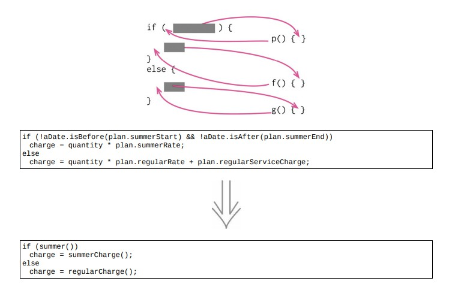

# 10.1 分解条件表达式



## 使用场景

- 复杂的条件逻辑是最常导致复杂度上升的地点之一

- 将复杂的条件逻辑分解成多个独立的函数，根据每个小块大妈的用途，为分解而得的新函数命名

本重构手法，是[提炼函数](../Chapter_6/6.1_extract_function.md)的一个应用场景

### 重构前

```java
if (!aDate.isBefore(plan.summerStart) && !aDate.isAfter(plan.summerEnd))
    charge = quantity * plan.summerRate;
else
    charge = quantity * plan.regularRate + plan.regularServiceCharge;
```

### STEP1. 将条件判断提炼到一个独立的函数中

```java
if (summer())
    charge = quantity * plan.summerRate;
else
    charge = quantity * plan.regularRate + plan.regularServiceCharge;

function summer()
{
    return !aDate.isBefore(plan.summerStart) && !aDate.isAfter(plan.summerEnd);
}
```

### STEP2

### 1. 提炼条件判断为真的分支

```java
if (summer())
    charge = summerCharge();
else
    charge = quantity * plan.regularRate + plan.regularServiceCharge;

function summer()
{
    return !aDate.isBefore(plan.summerStart) && !aDate.isAfter(plan.summerEnd);
}
function summerCharge()
{
    return quantity * plan.summerRate;
}
```

### 2. 提炼条件判断为假的分支

```java
if (summer())
    charge = summerCharge();
else
    charge = regularCharge();
function summer()
{
    return !aDate.isBefore(plan.summerStart) && !aDate.isAfter(plan.summerEnd);
}
function summerCharge()
{
    return quantity * plan.summerRate;
}
function regularCharge()
{
    return quantity * plan.regularRate + plan.regularServiceCharge;
}
```

### STEP3. 用三元运算符重新安排条件语句

```java
charge = summer() ? summerCharge() : regularCharge();
function summer() {
return !aDate.isBefore(plan.summerStart) && !aDate.isAfter(plan.summerEnd);
}
function summerCharge() {
return quantity * plan.summerRate;
}
function regularCharge() {
return quantity * plan.regularRate + plan.regularServiceCharge;
}
```

## 重构完成🎀
