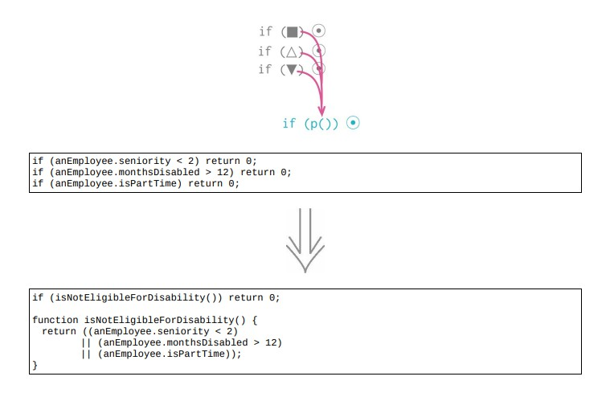

<!--
 * @Author: FEIFEI SUN
 * @Description: 
 * @Detail: 
 * @Date: 2023-04-24 15:47:32
 * 
-->
# 10.2 合并条件表达式



> [示例 1. 使用逻辑或 `||`]()
>
> [示例 2. 使用逻辑与 `&&`]()

## 使用场景

- 一串条件检查：检查条件不相同，最终行为却一致

- 用 `||` or `&&` 将它们合并为一个条件表达式

## 示例 1. 使用逻辑或 `||`

### 重构前

```java
function disabilityAmount(anEmployee)
{
    if (anEmployee.seniority < 2)
        return 0;
    if (anEmployee.monthsDisabled > 12)   
        return 0;
    if (anEmployee.isPartTime)
        return 0;
    // compute the disability amount
}
```

### STEP1. 合并条件

```java
function disabilityAmount(anEmployee)
{
    if ((anEmployee.seniority < 2)
        || (anEmployee.monthsDisabled > 12)
        || (anEmployee.isPartTime))
        return 0;
    // compute the disability amount
}
```

### STEP3. [提炼函数](../Chapter_6/6.1_extract_function.md)

```java
function disabilityAmount(anEmployee)
{
    if (isNotEligableForDisability())
        return 0;
    // compute the disability amount
    function isNotEligableForDisability() {
        return ((anEmployee.seniority < 2)
        || (anEmployee.monthsDisabled > 12)
        || (anEmployee.isPartTime));
    }
}
```

## 示例 2. 使用逻辑与 `&&`

### 重构前

```java
if (anEmployee.onVacation)
    if (anEmployee.seniority > 10)
        return 1;
return 0.5;
```

### 重构后

```java
if ((anEmployee.onVacation)
        && (anEmployee.seniority > 10)) return 1;
return 0.5;
```

## 重构完成🎀
