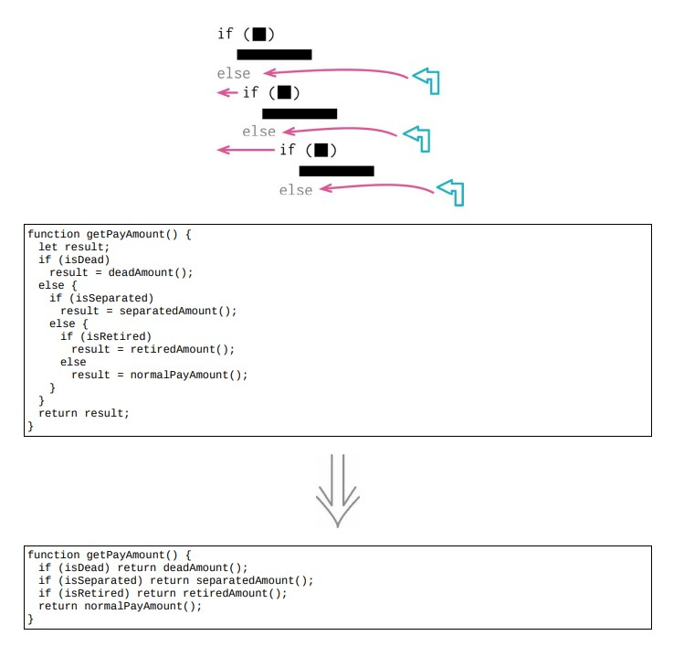

<!--
 * @Author: FEIFEI SUN
 * @Description: 
 * @Detail: 
 * @Date: 2023-04-24 15:48:04
 * 
-->
# 10.3 以卫语句取代嵌套条件表达式



> [示例 1.]()
>
> [示例 2. 将条件反转]()

## 使用场景

- 卫语句：如果某个条件及其罕见，应该单独检查该条件，并在该条件为真时立刻从函数中返回

- 以卫语句取代嵌套条件表达式的精髓：给某一条分支以特别的重视

## 示例 1

### 重构前

```java
function payAmount(employee)
{
    let result;
    if(employee.isSeparated)
    {
        result = {amount: 0, reasonCode:"SEP"};
    }
    else
    {
        if (employee.isRetired)
        {
            result = {amount: 0, reasonCode: "RET"};
        }
        else
        {
            // logic to compute amount
            lorem.ipsum(dolor.sitAmet);
            consectetur(adipiscing).elit();
            sed.do.eiusmod = tempor.incididunt.ut(labore) && dolore(magna.aliqua);
            ut.enim.ad(minim.veniam);
            result = someFinalComputation();
        }
    }
    return result;
}
```

### STEP1. 先处理最顶上的条件逻辑

```java
function payAmount(employee)
{
    let result;
    if (employee.isSeparated) return {amount: 0, reasonCode: "SEP"};
    if (employee.isRetired)
    {
        result = {amount: 0, reasonCode: "RET"};
    }
    else
    {
        // logic to compute amount
        lorem.ipsum(dolor.sitAmet);
        consectetur(adipiscing).elit();
        sed.do.eiusmod = tempor.incididunt.ut(labore) && dolore(magna.aliqua);
        ut.enim.ad(minim.veniam);
        result = someFinalComputation();
    }
    return result;
}
```

### STEP2. 处理第二个条件逻辑

```java
function payAmount(employee)
{
    let result;
    if (employee.isSeparated) return {amount: 0, reasonCode: "SEP"};
    if (employee.isRetired) return {amount: 0, reasonCode: "RET"};
    // logic to compute amount
    lorem.ipsum(dolor.sitAmet);
    consectetur(adipiscing).elit();
    sed.do.eiusmod = tempor.incididunt.ut(labore) && dolore(magna.aliqua);
    ut.enim.ad(minim.veniam);
    result = someFinalComputation();
    return result;
}
```

- 内联变量

```java
function payAmount(employee)
{
    let result;
    if (employee.isSeparated) return {amount: 0, reasonCode: "SEP"};
    if (employee.isRetired) return {amount: 0, reasonCode: "RET"};
    // logic to compute amount
    lorem.ipsum(dolor.sitAmet);
    consectetur(adipiscing).elit();
    sed.do.eiusmod = tempor.incididunt.ut(labore) && dolore(magna.aliqua);
    ut.enim.ad(minim.veniam);
    return someFinalComputation();
}
```

## 示例 2. 将条件反转

### 重构前

```java
function adjustedCapital(anInstrument)
{
    let result = 0;
    if (anInstrument.capital > 0)
    {
        if (anInstrument.interestRate > 0 && anInstrument.duration > 0)
        {
            result = (anInstrument.income / anInstrument.duration) * anInstrument.adjustmentFactor;
        }
    }
    return result;
}
```

### STEP1. 先处理最顶上的条件逻辑

```java
function adjustedCapital(anInstrument)
{
let result = 0;
// 反转条件
if (anInstrument.capital <= 0) return result;
if (anInstrument.interestRate > 0 && anInstrument.duration > 0)
{
    result = (anInstrument.income / anInstrument.duration) * anInstrument.adjustmentFactor;
}
return result;
}
```

### STEP2. 处理第二个条件逻辑

- 先加入一个逻辑非

```java
function adjustedCapital(anInstrument)
{
    let result = 0;
    if (anInstrument.capital <= 0) return result;
    // 逻辑非
    if (!(anInstrument.interestRate > 0 && anInstrument.duration > 0)) return result;
    result = (anInstrument.income / anInstrument.duration) * anInstrument.adjustmentFactor;
    return result;
}
```

- 简化

```java
function adjustedCapital(anInstrument)
{
    let result = 0;
    if (anInstrument.capital <= 0) return result;
    // 加入逻辑或
    if (anInstrument.interestRate <= 0 || anInstrument.duration <= 0) return result;
    result = (anInstrument.income / anInstrument.duration) * anInstrument.adjustmentFactor;
    return result;
}
```

### STEP3. [合并条件表达式](./10.2_consolidate_conditional_expression.md)

```java
function adjustedCapital(anInstrument)
{
    let result = 0;
    if ( anInstrument.capital <= 0
        || anInstrument.interestRate <= 0
        || anInstrument.duration <= 0) return result;
    result = (anInstrument.income / anInstrument.duration) * anInstrument.adjustmentFactor;
    return result;
}
```

- 内联变量

```java
function adjustedCapital(anInstrument)
{
    if ( anInstrument.capital <= 0
        || anInstrument.interestRate <= 0
        || anInstrument.duration <= 0) return 0;
    return (anInstrument.income / anInstrument.duration) * anInstrument.adjustmentFactor;
}
```

## 重构完成🎀
