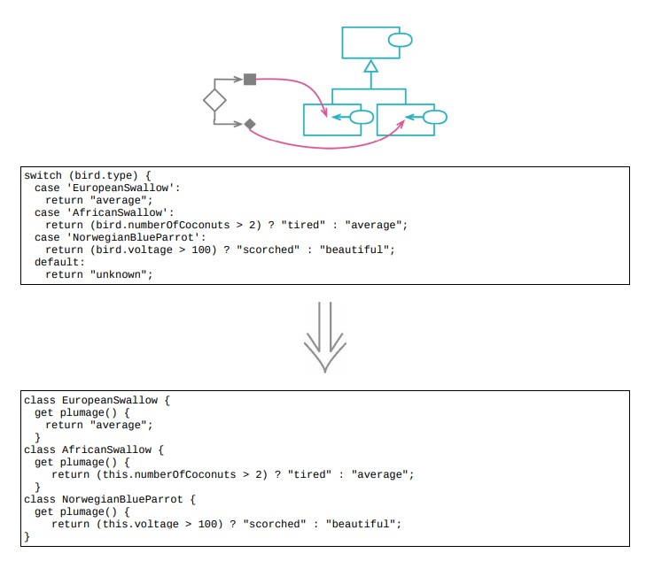

<!--
 * @Author: FEIFEI SUN
 * @Description: 
 * @Detail: 
 * @Date: 2023-04-24 15:48:22
 * 
-->
# 10.4 以多态取代条件表达式



## 使用场景

- 给复杂的条件逻辑添加结构

- 将条件逻辑拆分到不同的场景

1. 场景一：构造一组类型，每个类型处理各自的一种条件逻辑

2. 场景二：有意个基础逻辑，在其上又有一些变体。基础逻辑放进超类，变体逻辑放进一个子类

### 重构前

- `function plumage` 和 `function airSpeedVelocity` 的行为会随着 `bird.type` 发生变化，可以创建除对应的类，用多态来处理各类型特有的行为

```java
function plumages(birds)
{
    return new Map(birds.map(b => [b.name, plumage(b)]));
}
function speeds(birds)
{
    return new Map(birds.map(b => [b.name, airSpeedVelocity(b)]));
}
function plumage(bird)
{
    switch (bird.type)
    {
        case 'EuropeanSwallow':
            return "average";
        case 'AfricanSwallow':
            return (bird.numberOfCoconuts > 2) ? "tired" : "average";
        case 'NorwegianBlueParrot':
            return (bird.voltage > 100) ? "scorched" : "beautiful";
        default:
            return "unknown";
    }
}
function airSpeedVelocity(bird)
{
    switch (bird.type)
    {
        case 'EuropeanSwallow':
            return 35;
        case 'AfricanSwallow':
            return 40 - 2 * bird.numberOfCoconuts;
        case 'NorwegianBlueParrot':
            return (bird.isNailed) ? 0 : 10 + bird.voltage / 10;
        default:
            return null;
    }
}
```

### STEP1. 先将 `function plumage` 和 `function airSpeedVelocity` 两个函数使用[函数组合成类](../Chapter_6/6.9_combine_functions_into_class.java)

```java
function plumage(bird)
{
    return new Bird(bird).plumage;
}

function airSpeedVelocity(bird)
{
    return new Bird(bird).airSpeedVelocity;
}

class Bird
{
    constructor(birdObject)
    {
        Object.assign(this, birdObject);
    }
    get plumage()
    {
        switch (bird.type)
        {
            case 'EuropeanSwallow':
                return "average";
            case 'AfricanSwallow':
                return (bird.numberOfCoconuts > 2) ? "tired" : "average";
            case 'NorwegianBlueParrot':
                return (bird.voltage > 100) ? "scorched" : "beautiful";
            default:
                return "unknown";
        }
    }
    get airSpeedVelocity()
    {
        switch (bird.type)
        {
            case 'EuropeanSwallow':
                return 35;
            case 'AfricanSwallow':
                return 40 - 2 * bird.numberOfCoconuts;
            case 'NorwegianBlueParrot':
                return (bird.isNailed) ? 0 : 10 + bird.voltage / 10;
            default:
                return null;
        }
    }
}
```

### STEP2. 针对每种鸟创建一个子类，用一个工厂函数来实例化合适的子类对象

```java
function plumage(bird)
{
    return createBird(bird).plumage;
}
function airSpeedVelocity(bird)
{
    return createBird(bird).airSpeedVelocity;
}
function createBird(bird)
{
    switch (bird.type)
    {
        case 'EuropeanSwallow':
            return new EuropeanSwallow(bird);
        case 'AfricanSwallow':
            return new AfricanSwallow(bird);
        case 'NorweigianBlueParrot':
            return new NorwegianBlueParrot(bird);
        default:
            return new Bird(bird);
    }
}
class EuropeanSwallow extends Bird
{}
class AfricanSwallow extends Bird
{}
class NorwegianBlueParrot extends Bird
{}
```

### STEP3. 已经有了需要的类结果，可以处理两个条件逻辑了

- 先处理 `plumage`

```java
class EuropeanSwallow extends Bird
{
    get plumage()
    {
        return "average";
    }
}

class Bird
{
    get plumage()
    {
        switch (this.type)
        {
            // 修改超类
            case 'EuropeanSwallow':
                throw "oops";
            case 'AfricanSwallow':
                return (this.numberOfCoconuts > 2) ? "tired" : "average";
            case 'NorwegianBlueParrot':
                return (this.voltage > 100) ? "scorched" : "beautiful";
            default:
                return "unknown";
        }
    }
}

```

- 再处理其他两种鸟

```java
class AfricanSwallow
{
    get plumage()
    {
        return (this.numberOfCoconuts > 2) ? "tired" : "average";
    }
}

class NorwegianBlueParrot
{
    get plumage()
    {
        return (this.voltage >100) ? "scorched" : "beautiful";
    }
}
```

- 此时的超类变成

```java
class Bird
{
    get plumage()
    {
        return "unknown";
    }
}
```

### STEP4. 对 `airSpeedVelocity` 函数也采取同样操作，得到最终结果

```java
function plumages(birds)
{
    return new Map(birds
                    .map(b => createBird(b))
                    .map(bird => [bird.name, bird.plumage]));
}
function speeds(birds)
{
    return new Map(birds
                    .map(b => createBird(b))
                    .map(bird => [bird.name, bird.airSpeedVelocity]));
}
function createBird(bird)
{
    switch (bird.type)
    {
    case 'EuropeanSwallow':
        return new EuropeanSwallow(bird);
    case 'AfricanSwallow':
        return new AfricanSwallow(bird);
    case 'NorwegianBlueParrot':
        return new NorwegianBlueParrot(bird);
    default:
        return new Bird(bird);
}
}
class Bird
{
    constructor(birdObject)
    {
        Object.assign(this, birdObject);
    }
    get plumage()
    {
        return "unknown";
    }
    get airSpeedVelocity()
    {
        return null;
    }
}

class EuropeanSwallow extends Bird
{
    get plumage()
    {
        return "average";
    }
    get airSpeedVelocity()
    {
        return 35;
    }
}
class AfricanSwallow extends Bird
{
    get plumage()
    {
        return (this.numberOfCoconuts > 2) ? "tired" : "average";
    }
    get airSpeedVelocity()
    {
        return 40 - 2 * this.numberOfCoconuts;
    }
}

class NorwegianBlueParrot extends Bird
{
    get plumage()
    {
        return (this.voltage > 100) ? "scorched" : "beautiful";
    }
    get airSpeedVelocity()
    {
        return (this.isNailed) ? 0 : 10 + this.voltage / 10;
    }
}
```

## 重构完成🎀
