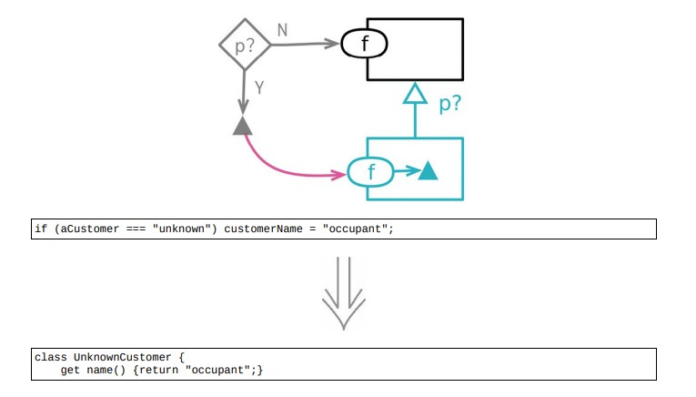

<!--
 * @Author: FEIFEI SUN
 * @Description: 
 * @Detail: 
 * @Date: 2023-04-24 15:48:37
 * 
-->
# 10.5 引入特例



## 使用场景

- 对于特例的共用行为的处理

- 一个通常需要特例处理的值就是 `null`

### 重构前

```java
class Site
{
    get customer() {return this._customer;}
}


class Customer
{
    get name() {...}
    get billingPlan() {...}
    set billingPlan(arg) {...}
    get paymentHistory() {...}
}

// client 1
const aCustomer = site.customer;
// ... lots of intervening code ...
let customerName;
if (aCustomer === "unknown") customerName = "occupant";
else customerName = aCustomer.name;

// client 2
const plan = (aCustomer === "unknown") ?
    registry.billingPlans.basic
    : aCustomer.billingPlan;

// client 3
if (aCustomer !== "unknown") aCustomer.billingPlan = newPlan;

// client 4
const weeksDelinquent = (aCustomer === "unknown") ?
        0
        : aCustomer.paymentHistory.weeksDelinquentInLastYear;

```

## 重构wanchen
