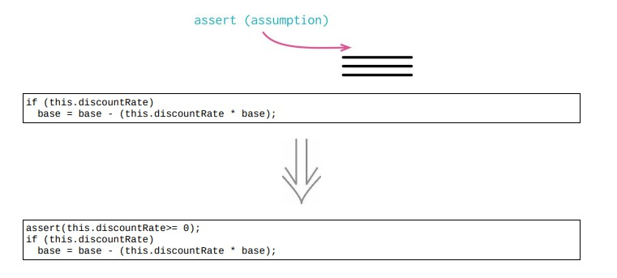

# 10.6 引入断言



## 使用场景

- 有一段代码，如果只有当某个条件为真时，该段代码才能正常运行

- 使用 assert 来明确表明这些假设

- assert 是一个条件表达式，应该总是为真

- assert 告诉阅读者，程序在执行到这一点时，对当前状态做了何种假设

### 重构前

- 折扣率永远是正数

```java
class Customer
{
    applyDiscount(aNumber)
    {
        return (this.discountRate)
            ? aNumber - (this.discountRate * aNumber)
            : aNumber;
    }
}
```

### STEP1. 在三元表达式中插入 assert 不是很简单

- 转换成 `if else`

```java
class Customer
{
    applyDiscount(aNumber)
    {
        if (!this.discountRate) return aNumber;
        else return aNumber - (this.discountRate * aNumber);
    }
}
```

### STEP2. 加入 assert

```java
class Customer
{
    applyDiscount(aNumber)
    {
        if (!this.discountRate) return aNumber;
        else
        {
            // NOTE
            assert(this.discountRate >= 0);
            return aNumber - (this.discountRate * aNumber);
        }
    }
}
```

### STEP3. 真正引起错误的源头很难发现，利用 assert

```java
class Customer
{
    set discountRate(aNumber)
    {
        assert(null === aNumber || aNumber >= 0);
        this._discountRate = aNumber;
    }
}
```

##

## 重构完成🎀
