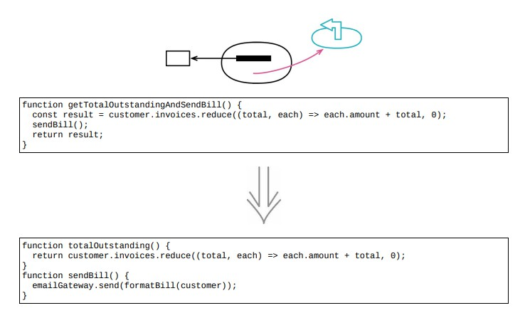

<!--
 * @Author: FEIFEI SUN
 * @Description: 
 * @Detail: 
 * @Date: 2023-04-28 10:07:48
 * 
-->
# 11.1 将查询函数和修改函数分离



## 使用场景

- 任何有返回值的函数，都不应该有看得到的副作用

> 看得到的副作用的优化方法：将查询所得结果缓存于某个字段中，这样一来后续的重复查询就可以大大加快速度

> `mf-cqs` ：command-query separation

- 既有返回值又有副作用的函数，从查询动作到修改动作中分离出来

### 重构前

- 函数作用：

  - 遍历一份 `miscreant` 名单，检查一群 `people` 中是否混进了恶棍。

  - 如果发现了 `miscreant` 就返回他的名字

```java
function alertForMiscreant (people)
{
    for (const p of people)
    {
        if (p === "Don")
        {
            setOffAlarms();
            return "Don";
        }
        if (p === "John")
        {
            setOffAlarms();
            return "John";
        }
    }
    return "";
}
```

### STEP1. 复制整个函数，将其作为一个查询来命名

```java
function findMiscreant (people)
{
    for (const p of people)
    {
        if (p === "Don")
        {
            setOffAlarms();
            return "Don";
        }
        if (p === "John")
        {
            setOffAlarms();
            return "John";
        }
    }
    return "";
}
```

### STEP2. 从新建的查询函数中去掉所有造成副作用的语句

```java
function findMiscreant (people)
{
    for (const p of people)
    {
        if (p === "Don")
        {
            // setOffAlarms();
            return "Don";
        }
        if (p === "John")
        {
            // setOffAlarms();
            return "John";
        }
    }
    return "";
}
```

### STEP3. 查找所有原函数的调用者，将其修改为调用新建的查询函数，并在其后调用一次原函数

- 重构前：调用者

```java
const found = alertForMiscreant(people);
```

- 重构后：调用者

```java
const found = findMiscreant(people);
alertForMiscreant(people);
```

### STEP4. 从修改函数中去掉所有返回值

```java
function alertForMiscreant (people)
{
    for (const p of people)
    {
        if (p === "Don")
        {
            setOffAlarms();
            return /*"Don"*/;
        }
        if (p === "John")
        {
            setOffAlarms();
            return /*"John"*/;
        }
    }
    return "";
}
```

### STEP5. 查询函数与原函数之间存在大量重复代码，使用 [7.9 替换算法](../Chapter_7/7.9_substitute_algorithm.md)

```java
function alertForMiscreant (people)
{
    // 替换算法
    if (findMiscreant(people) !== "")
        setOffAlarms();
}

```

### 重构后

```java
function alertForMiscreant (people)
{
    if (findMiscreant(people) !== "")
        setOffAlarms();
}

function findMiscreant (people)
{
    for (const p of people)
    {
        if (p === "Don")
        {
            // setOffAlarms();
            return "Don";
        }
        if (p === "John")
        {
            // setOffAlarms();
            return "John";
        }
    }
    return "";
}
```

- 调用者

```java
const found = findMiscreant(people);
alertForMiscreant(people);
```

## 重构完成🎀
