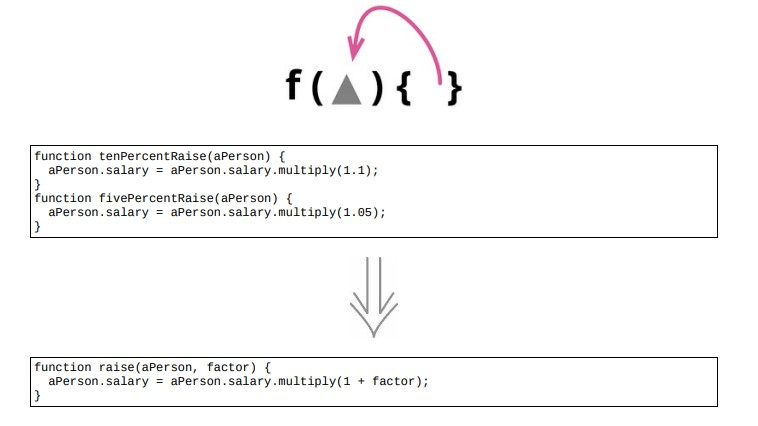

# 11.2 函数参数化



## 使用场景

- 如果有两个函数逻辑相似，只有一些字面量值不同，可以将其合并成一个函数，以参数的形式传入不同的值，从而消除重复。

## 示例 1. 一个简单的例子

### 重构前

```java
function tenPercentRaise(aPerson)
{
    aPerson.salary = aPerson.salary.multiply(1.1);
}
function fivePercentRaise(aPerson)
{
    aPerson.salary = aPerson.salary.multiply(1.05);
}
```

### 重构后

```java
function raise(aPerson, factor)
{
    aPerson.salary = aPerson.salary.multiply(1 + factor);
}
```

## 示例 2. 稍微复杂一点的例子

### 重构前

```java
function baseCharge(usage)
{
    if (usage < 0) return usd(0);
    const amount =
            bottomBand(usage) * 0.03
            + middleBand(usage) * 0.05
            + topBand(usage) * 0.07;
    return usd(amount);
}
function bottomBand(usage)
{
    return Math.min(usage, 100);
}
function middleBand(usage)
{
    return usage > 100 ? Math.min(usage, 200) - 100 : 0;
}
function topBand(usage)
{
    return usage > 200 ? usage - 200 : 0;
}
```

### STEP1. 从一组相似的函数中选择一个

- 类似这样处理范围的情况，通常从位于中间的范围开始着实比较好

```java
function middleBand(usage)
{
    return usage > 100 ? Math.min(usage, 200) - 100 : 0;
}
```

### STEP2. 运用 [6.5 改变函数声明](../Chapter_6/6.5_change_function_declaration.md)， 把需要作为参数传入的字面量添加到参数列表中

```java
function /*middleBand*/withinBand(usage, bottom, top)
{
    return usage > 100 ? Math.min(usage, 200) - 100 : 0;
}
function baseCharge(usage)
{
    if (usage < 0) return usd(0);
    const amount =
            bottomBand(usage) * 0.03
            + withinBand(usage, 100, 200) * 0.05
            + topBand(usage) * 0.07;
    return usd(amount);
}
```

- 在函数体内部，把一个字面量改为使用新传入的参数

```java
function withinBand(usage, bottom, top)
{
    return usage > bottom ? Math.min(usage, top) - bottom : 0;
}
```

### STEP3. 修改该函数所有的调用处，使其在调用时传入该字面量值

- 将原本调用 `bottomBand` 函数的地方，将其改为调用参数化了的新函数

```java
function baseCharge(usage)
{
    if (usage < 0) return usd(0);
    const amount =
            /*bottomBand(usage) * 0.03*/
            withinBand(usage, 0, 100) * 0.03
            + withinBand(usage, 100, 200) * 0.05
            + topBand(usage) * 0.07;
    return usd(amount);
}
// function bottomBand(usage)
// {
//     return Math.min(usage, 100);
// }
```

- 替换对 `topBand` 的调用，用代表“无穷大”的 `Infinity` 作为这个范围的上界

```java
function baseCharge(usage)
{
    if (usage < 0) return usd(0);
    const amount =
            withinBand(usage, 0, 100) * 0.03
            + withinBand(usage, 100, 200) * 0.05
            + withinBand(usage, 200, Infinity) * 0.07;
            /*+ topBand(usage) * 0.07*/;
    return usd(amount);
}
// function topBand(usage)
// {
//     return usage > 200 ? usage - 200 : 0;
// }
```

### 重构后

```java
function withinBand(usage, bottom, top)
{
    return usage > bottom ? Math.min(usage, top) - bottom : 0;
}
function baseCharge(usage)
{
    if (usage < 0) return usd(0);
    const amount =
            withinBand(usage, 0, 100) * 0.03
            + withinBand(usage, 100, 200) * 0.05
            + withinBand(usage, 200, Infinity) * 0.07;
            /*+ topBand(usage) * 0.07*/;
    return usd(amount);
}
```

## 重构完成🎀
