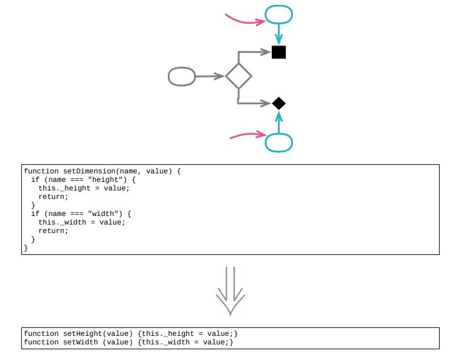

<!--
 * @Author: FEIFEI SUN
 * @Description: 
 * @Detail: 
 * @Date: 2023-04-28 10:09:15
 * 
-->
# 11.3 移除标记参数



## 使用场景

- 标记参数，隐藏了函数调用中存在的差异性

- 如果一个函数中有多个标记参数，可能不得不将其保留，否则就得针对各个参数的各个取值的所有组合情况提供明确函数

### 重构前

- 调用函数计算 `shipment` 的 `deliveryDate`

```java
aShipment.deliveryDate = deliveryDate(anOrder, true);
```

- 其他的调用代码

```java
aShipment.deliveryDate = deliveryDate(anOrder, false);
```

- 从第二个参数的 `true` 和 `false` 很难搞清楚函数调用中的差异性

- `deliveryDate` 函数的主体

```java
function deliveryDate(anOrder, isRush)
{
    if (isRush)
    {
        let deliveryTime;
        if (["MA", "CT"] .includes(anOrder.deliveryState)) deliveryTime = 1;
        else if (["NY", "NH"].includes(anOrder.deliveryState)) deliveryTime = 2;
        else deliveryTime = 3;
        return anOrder.placedOn.plusDays(1 + deliveryTime);
    }
    else
    {
        let deliveryTime;
        if (["MA", "CT", "NY"].includes(anOrder.deliveryState)) deliveryTime = 2;
        else if (["ME", "NH"] .includes(anOrder.deliveryState)) deliveryTime = 3;
        else deliveryTime = 4;
        return anOrder.placedOn.plusDays(2 + deliveryTime);
    }
}
```

### STEP1. 利用 [10.1 分解条件表达式](../Chapter_10/10.1_decompose_consitional.md)

```java
function deliveryDate(anOrder, isRush)
{
    if (isRush) return rushDeliveryDate(anOrder);
    else return regularDeliveryDate(anOrder);
}
function rushDeliveryDate(anOrder)
{
    let deliveryTime;
    if (["MA", "CT"] .includes(anOrder.deliveryState)) deliveryTime = 1;
    else if (["NY", "NH"].includes(anOrder.deliveryState)) deliveryTime = 2;
    else deliveryTime = 3;
    return anOrder.placedOn.plusDays(1 + deliveryTime);
}
function regularDeliveryDate(anOrder)
{
    let deliveryTime;
    if (["MA", "CT", "NY"].includes(anOrder.deliveryState)) deliveryTime = 2;
    else if (["ME", "NH"] .includes(anOrder.deliveryState)) deliveryTime = 3;
    else deliveryTime = 4;
    return anOrder.placedOn.plusDays(2 + deliveryTime);
}
```

### STEP2. 修改调用方代码

- rush

```java
aShipment.deliveryDate = rushDeliveryDate(anOrder);
```

- regular

```java
aShipment.deliveryDate = regularDeliveryDate(anOrder);
```

## 重构完成🎀
