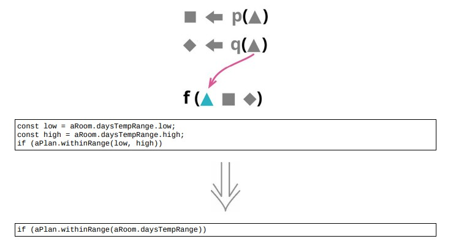

<!--
 * @Author: FEIFEI SUN
 * @Description: 
 * @Detail: 
 * @Date: 2023-04-28 10:09:35
 * 
-->
# 11.4 保持对象完整



## 使用场景

- 如果一串代码从一个记录结构中导出几个值，然后又把这几个值一起传递给一个函数，更好的做法是：直接将整个记录传给这个函数，在函数体内部导出所需的值。

## 示例 1. 直接编写新函数

### 重构前

- 调用方

```java
const low = aRoom.daysTempRange.low;
const high = aRoom.daysTempRange.high;
if (!aPlan.withinRange(low, high))
    alerts.push("room temperature went outside range");
```

- 函数体

```java
class HeatingPlan
{
    withinRange(bottom, top)
    {
        return (bottom >= this._temperatureRange.low) && (top <= this._temperatureRange.high);
    }   
}
```

- 其实不必将温度范围的信息拆开单独传递，可以将整个范围对象传递给 withinRange 函数

### STEP1. 在 `HeatingPlan` 类中新增一个空函数，设置合适的参数列表，并在函数体内调用现有的 `withinRange` 函数

```java
class HeatingPlan
{
    withinRange(bottom, top)
    {
        return (bottom >= this._temperatureRange.low) && (top <= this._temperatureRange.high);
    }
    xxNEWwithinRange(aNumberRange)
    {
        return this.withinRange(aNumberRange.low, aNumberRange.high);
    }
}
```

### STEP2. 找到调用现有函数的地方，将其改为调用新函数

- 调用方

```java
const low = aRoom.daysTempRange.low;
const high = aRoom.daysTempRange.high;
// 替换成新函数
if (!aPlan.xxNEWwithinRange(aRoom.daysTempRange))
    alerts.push("room temperature went outside range");
```

- 修改调用处时，利用 [8.9 移除死代码](../Chapter_8/8.9_remove_dead_code.md) 将不再需要的代码移除

```java
// const low = aRoom.daysTempRange.low;
// const high = aRoom.daysTempRange.high;

if (!aPlan.xxNEWwithinRange(aRoom.daysTempRange))
    alerts.push("room temperature went outside range");
```

### STEP3. 利用 [6.2 内联函数](../Chapter_6/6.2_inline_function.md) 将旧函数内联到新函数体内

```java
class HeatingPlan
{
    // withinRange(bottom, top)
    // {
    //     return (bottom >= this._temperatureRange.low) && (top <= this._temperatureRange.high);
    // }
    xxNEWwithinRange(aNumberRange)
    {
        return (aNumberRange.bottom >= this._temperatureRange.low) && (aNumberRange.top <= this._temperatureRange.high);
    }
}
```

### 重构后

```java
class HeatingPlan
{
    withinRange(aNumberRange)
    {
        return (aNumberRange.bottom >= this._temperatureRange.low) && (aNumberRange.top <= this._temperatureRange.high);
    }
}
```

- 调用方

```java
if (!aPlan.xxNEWwithinRange(aRoom.daysTempRange))
    alerts.push("room temperature went outside range");
```

## 示例 2. 换个方式创建新函数

### 重构前

- 调用方

```java
const low = aRoom.daysTempRange.low;
const high = aRoom.daysTempRange.high;
if (!aPlan.withinRange(low, high))
    alerts.push("room temperature went outside range");
```

### STEP1. 先整理代码，以便用 [6.1 提炼函数](../Chapter_6/6.1_extract_function.md) 来创建新变量

- 调用方

```java
const low = aRoom.daysTempRange.low;
const high = aRoom.daysTempRange.high;
const isWithinRange = aPlan.withinRange(low, high);
if (!isWithinRange)
    alerts.push("room temperature went outside range");
```

### STEP2. 将输入参数也提炼出来

- 调用方

```java
const tempRange = aRoom.daysTempRange;
const low = tempRange.low;
const high = tempRange.high;
const isWithinRange = aPlan.withinRange(low, high);
if (!isWithinRange)
    alerts.push("room temperature went outside range");
```

### STEP3. 利用 [6.1 提炼函数](../Chapter_6/6.1_extract_function.md) 来创建新函数

- 调用方

```java
const tempRange = aRoom.daysTempRange;
const isWithinRange = xxNEWwithinRange(aPlan, tempRange);
if (!isWithinRange)
    alerts.push("room temperature went outside range"); 
```

- 顶层作用域

```java
function xxNEWwithinRange(aPlan, tempRange)
{
    const low = tempRange.low;
    const high = tempRange.high;
    const isWithinRange = aPlan.withinRange(low, high);
    return isWithinRange;
}
```

### STEP4. 由于旧函数属于另一个上下文 `class HeatingPlan`， 利用 [8.3 搬移函数](../Chapter_8/8.3_move_statements_into_function.md) 把新函数也搬过去

- 调用方

```java
const tempRange = aRoom.daysTempRange;
const isWithinRange = aPlan.xxNEWwithinRange(tempRange);
if (!isWithinRange)
    alerts.push("room temperature went outside range");
```

```java
class HeatingPlan
{
    xxNEWwithinRange(tempRange)
    {
        const low = tempRange.low;
        const high = tempRange.high;
        const isWithinRange = this.withinRange(low, high);
        return isWithinRange;
    }
}
```

### STEP5. 替换其他调用者，将旧函数内敛到新函数

## 重构完成🎀
