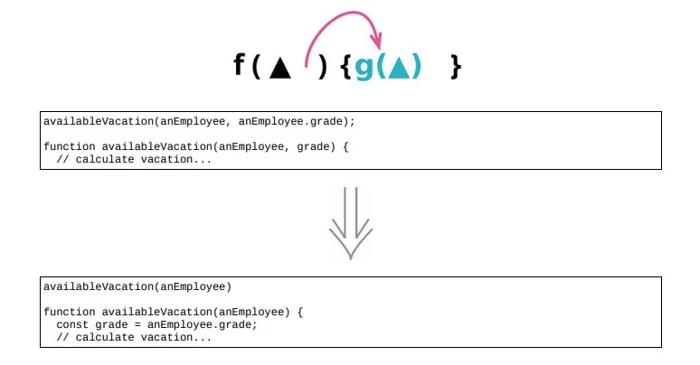

<!--
 * @Author: FEIFEI SUN
 * @Description: 
 * @Detail: 
 * @Date: 2023-04-28 10:10:45
 * 
-->
# 11.5 以查询取代参数



> [反向重构：11.6 以参数取代查询](./11.6_replace_query_with_parameter.md)

## 使用场景

- 函数的参数列表应该总结该函数的可变性，表示出函数可能体现出行为差异的主要方式

- 参数列表应该尽量避免重复，并且参数列表越短就越容易理解

### 重构前

```java
class Order
{
    get finalPrice()
    {
        const basePrice = this.quantity * this.itemPrice;
        let discountLevel;
        if (this.quantity > 100) discountLevel = 2;
        else discountLevel = 1;
        return this.discountedPrice(basePrice, discountLevel);
    }
    discountedPrice(basePrice, discountLevel)
    {
        switch (discountLevel)
        {
            case 1: return basePrice * 0.95;
            case 2: return basePrice * 0.9;
        }
    }
}
```

### STEP1. 利用 [7.4 以查询取代临时变量](../Chapter_7/7.4_replace_temp_with_query.md)

```java
class Order
{
    get finalPrice()
    {
        const basePrice = this.quantity * this.itemPrice;
        return this.discountedPrice(basePrice, this.discountLevel);
    }
    get discountLevel()
    {
        return (this.quantity > 100) ? 2 : 1;
    }
    discountedPrice(basePrice, discountLevel)
    {
        switch (this.discountLevel)
        {
            case 1: return basePrice * 0.95;
            case 2: return basePrice * 0.9;
        }
    }
}
```

### STEP2. 利用 [6.5 改变函数声明](../Chapter_6/6.5_change_function_declaration.md) 手法移除 `discountedPrice` 的 `discountLevel` 入参

```java
class Order
{
    get finalPrice()
    {
        const basePrice = this.quantity * this.itemPrice;
        return this.discountedPrice(basePrice/*, this.discountLevel*/);
    }
    get discountLevel()
    {
        return (this.quantity > 100) ? 2 : 1;
    }
    discountedPrice(basePrice/*, discountLevel*/)
    {
        switch (this.discountLevel)
        {
            case 1: return basePrice * 0.95;
            case 2: return basePrice * 0.9;
        }
    }
}
```

## 重构完成🎀
