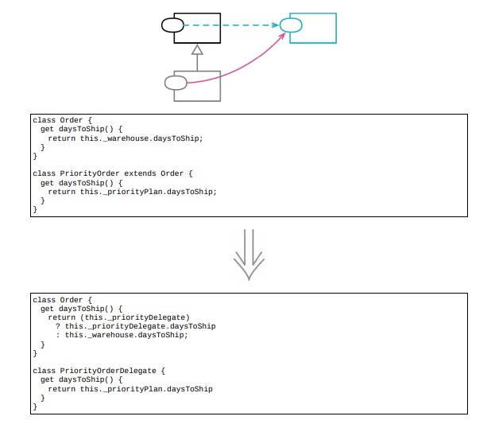

# 12.10 以委托取代子类



## 使用场景

- 继承给类之间引入了非常紧密的关系，在超类上做任何修改，都很可能破坏子类，用委托~

- 对象组合优于类继承

- 委托和组合是一回事

- @Date: 2023-04-23 16:25:29

### 重构前

```java
class Booking
{
    constructor(show, date)
    {
        this._show = show;
        this._date = date;
    }

    // 常规票在演出结束后会有对话创作者的环节，但仅仅是在非高峰日
    get hasTalkback()
    {
        return this._show.hasOwnProperty('talkback') && !this.isPeakDay;
    }

    // 定价逻辑
    get basePrice()
    {
        let result = this._show.price;
        if (this.isPeakDay)
            result += Math.round(result * 0.15);
        return result;
    }
}

class PremiumBooking extends Booking
{
    constructor(show, date, extras)
    {
        super(show, date);
        this._extras = extras;
    }

    // 复写了这个逻辑，任何一天都可以talkback
    get hasTalkback()
    {
        return this._show.hasOwnProperty('talkback');
    }

    // 定价逻辑，调用了超类中的方法
    get basePrice()
    {
        return Math.round(super.basePrice + this._extras.premiumFee);
    }

    // 定义了一个超类中没有的行为
    get hasDinner()
    {
        return this._extras.hasOwnProperty('dinner') && !this.isPeakDay;
    }
}
```

- client

```java
aBooking = new Booking(show, date);

aBooking = new PremiumBooking(show, date, extras);
```

### STEP1. 先用工厂函数取代构造函数，把构造函数封装起来

```java
function createBooking(show, date)
{
    return new Booking(show, date);
}
function createPremiumBooking(show, date, extras)
{
    return new PremiumBooking(show, date, extras);
}
```

- client

```java
aBooking = createBooking(show, date);

aBooking = createPremiumBooking(show, data, extras);
```

### STEP2. 新建一个委托类

- 构造参数由两部分：

- 1. 指向 `Booking` 对象的反向引用

- 2. 只有子类才需要的数据

```java
class PremiumBookingDelegate
{
    constructor(hostBooking, extras)
    {
        this._host = hostBooking;   // 指向 Booking 对象的反向引用
        this._extras = extras;      // 只有子类需要的数据
    }
}
```

### STEP3. 将新建的委托对象与 `Booking` 对象关联起来

```java
function createPremiumBooking(show, date, extras)
{
    const result = new PremiumBooking(show, date, extras);
    result._bePremium(extras);
    return result;
}

class Booking
{
    _bePremium(extras)
    {
        this._premiumDelegate = new PremiumBookingDelegate(this, extras);
    }
}
```

### STEP4. 结构设置好了，开始动手搬移

- hasTalkback 把子类的函数搬到委托类中

```java
class PremiumBookingDelegate
{
    get hasTalkback()
    {
        return this._host._show.hasOwnProperty('talkback');
    }
}

class PremiumBooking
{
    // 确保正常后删掉子类中的函数
    // get hasTalkback()
    // {
    //     return this._premiumDelegate.hasTalkback;
    // }
}

class Booking
{
    get hasTalkback()
    {
        return (this._premiumDelegate)
                   ? this._premiumDelegate.hasTalkback
                   : this._show.hasOwnProperty('talkback') && !this.isPeakDay;
    }
}
```

### STEP5. 搬移 `basePrice` 函数

```java
class PremiumBooking
{
    // 子类中调用了超类中的同名函数
    get basePrice()
    {
        return Math.round(super.basePrice + this._extras.premiumFee);
    }
}
```

- 可以重新定义委托对象中的函数，使其成为基础函数的扩展

```java
class Booking
{
    get basePrice()
    {
        let result = this._show.price;
        if (this.isPeakDay)
            result += Math.round(result * 0.15);
        return (this._premiumDelegate)
                   ? this._premiumDelegate.extendBasePrice(result)
                   : result;
    }
}

class PremiumBookingDelegate
{
    extendBasePrice(base)
    {
        return Math.round(base + this._extras.premiumFee);
    }
}
```

### STEP6. 搬移最后一个只存在于子类中的函数

```java
class PremiumBooking
{
    get hasDinner()
    {
        return this._extras.hasOwnProperty('dinner') && !this.isPeakDay;
    }
}

class PremiumBookingDelegate
{
    get hasDinner()
    {
        return this._extras.hasOwnProperty('dinner') && !this._host.isPeakDay;
    }
}
```

- 然后在 `Booking` 中添加分发逻辑

```java
class Booking
{
    get hasDinner()
    {
        return (this._premiumDelegate)
                   ? this._premiumDelegate.hasDinner
                   : undefined;
    }
}
```

### STEP7. 测试没有问题，删掉子类

```java
function createPremiumBooking(show, date, extras)
{
    const result = new PremiumBooking(show, date, extras);
    result._bePremium(extras);
    return result;
}
// class PremiumBooking extends Booking ...
```

### 重构后

- 顶层作用域

```java
function createPremiumBooking(show, date, extras)
{
    const result = new PremiumBooking(show, date, extras);
    result._bePremium(extras);
    return result;
}

class PremiumBookingDelegate
{
    constructor(hostBooking, extras)
    {
        this._host = hostBooking;
        this._extras = extras;
    }
    get hasTalkback()
    {
        return this._host._show.hasOwnProperty('talkback');
    }

    extendBasePrice(base)
    {
        return Math.round(base + this._extras.premiumFee);
    }

    get hasDinner()
    {
        return this._extras.hasOwnProperty('dinner') && !this._host.isPeakDay;
    }
}

class Booking
{
    constructor(show, date)
    {
        this._show = show;
        this._date = date;
    }
    _bePremium(extras)
    {
        this._premiumDelegate = new PremiumBookingDelegate(this, extras);
    }
    get hasTalkback()
    {
        return (this._premiumDelegate)
                   ? this._premiumDelegate.hasTalkback
                   : this._show.hasOwnProperty('talkback') && !this.isPeakDay;
    }
    get basePrice()
    {
        let result = this._show.price;
        if (this.isPeakDay)
            result += Math.round(result * 0.15);
        return (this._premiumDelegate)
                   ? this._premiumDelegate.extendBasePrice(result)
                   : result;
    }
    get hasDinner()
    {
        return (this._premiumDelegate)
                   ? this._premiumDelegate.hasDinner
                   : undefined;
    }
}
```

## 重构完成🎀
