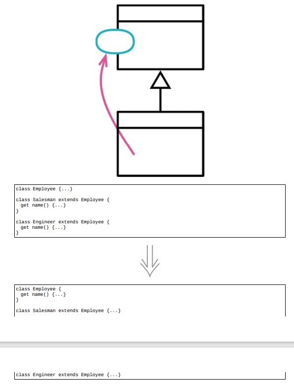

# 12.1 函数上移



> [反向重构：12.4 函数下移](./12.4_push_down_method.md)

## 使用场景

- 避免重复代码，如果某个函数在各个子类中的函数体都相同，就应该上移

@Date: 2023-04-23 15:07:50

### 重构前

- `Employee` 和 `Department` 重复实现了 `annualCost` 行为的函数，函数上移到超类

```java
class Employee extends Party
{
    get annualCost() { return this.monthlyCost * 12; }
}

class Department extends Party
{
    get totalAnnualCost() { return this.monthlyCost * 12; }
}
```

### STEP1. 用改变函数声明来统一他们的函数名

```java
class Department extends Party
{
    get annualCost() { return this.monthlyCost * 12; }
}
```

### STEP2. 从其中一个子类中将 `annualCost` 函数复制到超类 `Party` 中

```java
class Party
{
    get annualCost() { return this.monthlyCost * 12; }
}
```

## 重构完成🎀
