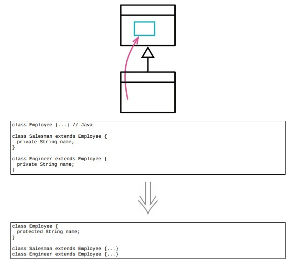

# 12.2 字段上移



> [反向重构：12.5 字段下移](./12.5_push_down_field.md)

## 使用场景

- 如果子类的字段中有重复的近似的名字，使用的方式也近似，可以提升到超类中

- @Date: 2023-04-23 15:17:15

### 重构前

```java
class Employee
{
    ...
}

class Salesman extends Employee
{
private
    String name;
}

class Engineer extends Employee
{
private
    String name;
}
```

### 重构后

```java
class Employee
{
protected
    String name; // 将name字段上移
}

class Salesman extends Employee
{
    ...
}

class Engineer extends Employee
{
    ...
}
```

## 重构完成🎀
