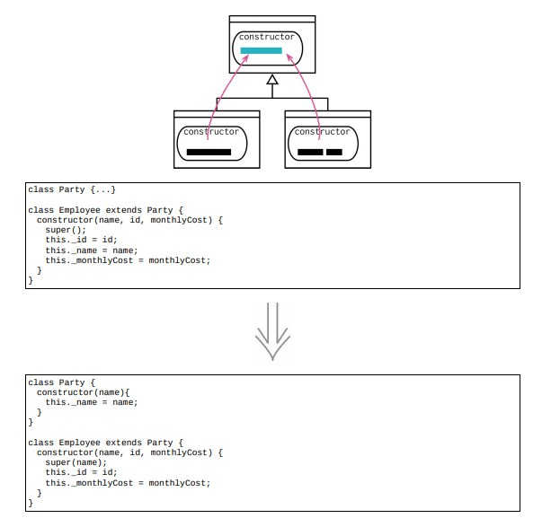

# 12.3 构造函数本体上移



## 使用场景

- 各个子类中的函数有共同的行为，提炼函数先将他们提炼到一个独立的函数中，然后使用函数上移将这个函数提升到超类

- @Date: 2023-04-23 15:20:56

### 重构前

- `Employee` 和 `Department` 中存在公共代码，对 `name` 的赋值

```java
class Party
{
}

class Employee extends Party
{
    constructor(name, id, monthlyCost)
    {
        super();
        this._id = id;
        this._name = name;
        this._monthlyCost = monthlyCost;
    }
    // rest of class...
}

class Department extends Party
{
    constructor(name, staff)
    {
        super();
        this._name = name;
        this._staff = staff;
    }
    // rest of class...
}
```

### STEP1. 先将 `Employee` 中的赋值语句到 `super()` 调用后面

```java
class Employee extends Party
{
    constructor(name, id, monthlyCost)
    {
        super();
        this._name = name;
        this._id = id;
        this._monthlyCost = monthlyCost;
    }
    // rest of class...
}
```

### STEP2. 将公共代码提升至超类的构造函数中，由于其中引用了一个子类构造函数传入的参数 `name` ，将该参数一并传给超类构造函数

```java
class Party
{
    constructor(name)
    {
        this._name = name;
    }
}

class Employee extends Party
{
    super(name);
    constructor(name, id, monthlyCost)
    {
        super();
        this._name = name;
        this._id = id;
        this._monthlyCost = monthlyCost;
    }
    // rest of class...
}

class Department extends Party
{
    constructor(name, staff)
    {
        super(name);
        this._staff = staff;
    }
}
```

## 重构完成🎀
