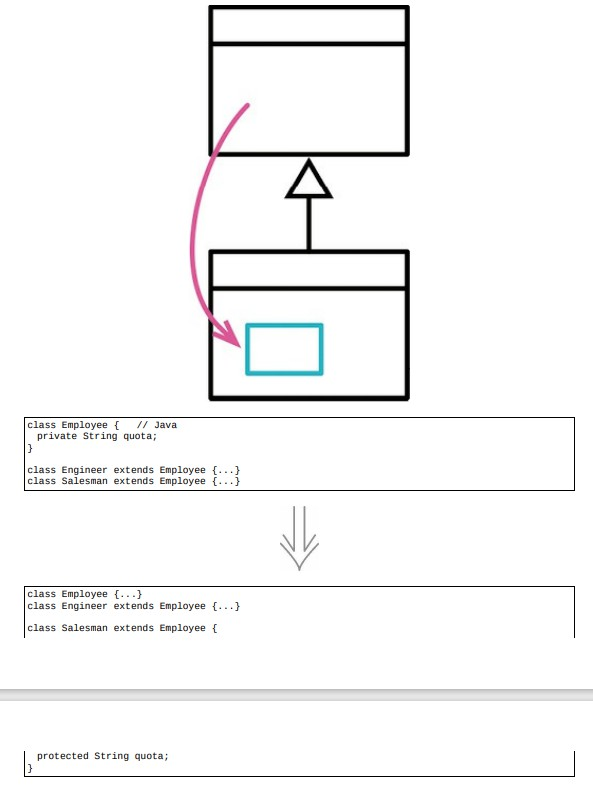

# 12.5 字段下移



> [反向重构：12.2 字段上移](./12.2_pull_up_field.md)

## 重构前

### 将 `quote` 字段下移

```java
class Employee
{
private
    String quota;
}

class Engineer extends Employee
{
    ...
}

class Salesman extends Employee
{
    ...
}

class Employee
{
    ...
}

class Engineer extends Employee
{
    ...
}

class Salesman extends Employee
{
protected
    String quota;
}
```

## 重构完成🎀
