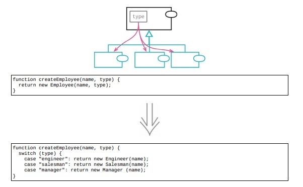

# 12.6 以子类取代类型码



> [反向重构：12.7 移除子类](./12.7_remove_subclass.md)

## 使用场景

- 表现分类关系的工具
- 1. 类型码字段
- 2. 引入子类

- @Date: 2023-04-23 15:37:39

### 重构前

```java
class Employee
{
    constructor(name, type)
    {
        this.validateType(type);
        this._name = name;
        this._type = type;
    }
    validateType(arg)
    {
        if (![ "engineer", "manager", "salesman" ].includes(arg))
            throw new Error(`Employee cannot be of type $ { arg }`);
    }
    toString() { return `${this._name}(${this._type})`; }
}
```

### STEP1. 封装变量，将类型码自封起来

```java
class Employee
{
    get type() { return this._type; }
    toString() { return `${this._name}(${this.type})`; }
}
```

// 从 engineer 类型码开始重构，直接继承 Employee类

```
class Engineer extends Employee
{
    get type() { return "engineer"; }
}
```

### STEP2. 新建一个工厂函数取代构造函数，以便安放选择器逻辑

```java
class Employee
{
    function createEmployee(name, type)
    {
        switch (type)
        {
        case "engineer":
            return new Engineer(name, type);
        case "salesman":
            return new Salesman(name, type);
        case "manager":
            return new Manager(name, type);
        }
        return new Employee(name, type);
    }
}

class Salesman extends Employee
{
    get type() { return "salesman"; }
}

class Manager extends Employee
{
    get type() { return "manager"; }
}
```

### STEP3. 去掉类型码字段以及在超类中的取值函数

```java
class Employee
{
    constructor(name, type)
    {
        this.validateType(type);
        this._name = name;
        // this._type = type;
    }
    // get type() {return this._type;}
    toString() { return `${this._name}(${this.type})`; }
}
```

### STEP4. 移除构造函数的类型参数

```java
class Employee
{
    constructor(name /*, type*/)
    {
        this._name = name;
    }
    function createEmployee(name, type)
    {
        switch (type)
        {
        case "engineer":
            return new Engineer(name /*, type*/);
        case "salesman":
            return new Salesman(name /*, type*/);
        case "manager":
            return new Manager(name /*, type*/);
        default:
            throw new Error(`Employee cannot be of type $ { type }`);
        }
    }
}
```

## 重构完成🎀
