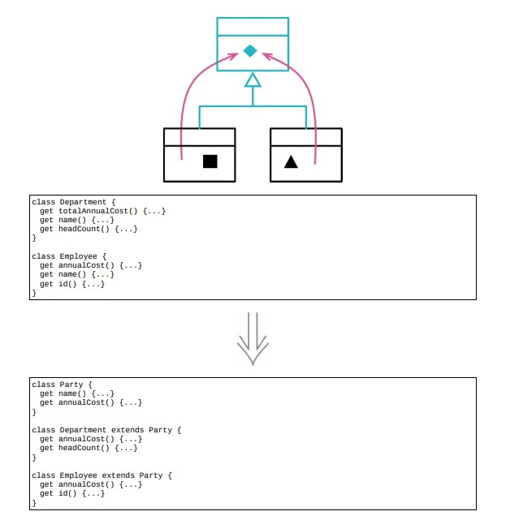

# 12.8 提炼超类



## 使用场景

- 两个类在做相似的事，可以利用基本的继承机制将他们的相似之处提炼到超类

- @Date: 2023-04-23 16:07:13

### 重构前

```java
class Employee
{
    constructor(name, id, monthlyCost)
    {
        this._id = id;
        this._name = name;
        this._monthlyCost = monthlyCost;
    }
    get monthlyCost() { return this._monthlyCost; }
    get name() { return this._name; }
    get id() { return this._id; }
    get annualCost()
    {
        return this.monthlyCost * 12;
    }
}

class Department
{
    constructor(name, staff)
    {
        this._name = name;
        this._staff = staff;
    }
    get staff() { return this._staff.slice(); }
    get name() { return this._name; }
    get totalMonthlyCost()
    {
        return this.staff
            .map(e = > e.monthlyCost)
            .reduce((sum, cost) = > sum + cost);
    }
    get headCount()
    {
        return this.staff.length;
    }
    get totalAnnualCost()
    {
        return this.totalMonthlyCost * 12;
    }
}
```

### STEP1. 提炼出一个共同的超类，先创建空类，然后让两个类继承它

```java
class Party
{
}

class Employee extends Party
{
    constructor(name, id, monthlyCost)
    {
        super();
        this._id = id;
        this._name = name;
        this._monthlyCost = monthlyCost;
    }
    // rest of class...
}

class Department extends Party
{
    constructor(name, staff)
    {
        super();
        this._name = name;
        this._staff = staff;
    }
    // rest of class...
}
```

### STEP2. 先从数据开始搬移，用字段上移把name字段搬到超类中

### 通过函数上移，把相关的函数也一起搬移，`get name()`

```java
class Party
{
    constructor(name)
    {
        this._name = name;
    }
    get name() { return this._name; }
}

class Employee extends Party
{
    constructor(name, id, monthlyCost)
    {
        super();
        this._id = id;
        // this._name = name;
        this._monthlyCost = monthlyCost;
    }
    get name() { return this._name; }
    // rest of class...
}

class Department extends Party
{
    constructor(name, staff)
    {
        super();
        // this._name = name;
        this._staff = staff;
    }
    get name() { return this._name; }
    // rest of class...
}
```

### STEP2. 改变函数声明将意图一致的函数统一

```java
class Department
{
    get annualCost()
    {
        return this.monthlyCost * 12;
    }
    get monthlyCost() { ... }
}
```

### STEP3. 函数上移到超类

```java
class Party
{
    get annualCost()
    {
        return this.monthlyCost * 12;
    }
}
```

- 在子类中移除函数

```java
class Employee
{
    constructor(name, id, monthlyCost)
    {
        this._id = id;
        // this._name = name;
        this._monthlyCost = monthlyCost;
    }
    get monthlyCost() { return this._monthlyCost; }
    // get name() { return this._name; }
    get id() { return this._id; }
    // get annualCost()
    // {
    //     return this.monthlyCost * 12;
    // }
}

class Department
{
    constructor(name, staff)
    {
        // this._name = name;
        this._staff = staff;
    }
    get staff() { return this._staff.slice(); }
    // get name() { return this._name; }
    get headCount()
    {
        return this.staff.length;
    }
    // get annualCost()
    // {
    //     return this.monthlyCost * 12;
    // }
    get monthlyCost() { ... }
}
```

### 重构后

```java
class Party
{
    constructor(name)
    {
        this._name = name;
    }
    get name() { return this._name; }
    get annualCost()
    {
        return this.monthlyCost * 12;
    }
}

// 在子类中移除函数
class Employee
{
    constructor(name, id, monthlyCost)
    {
        this._id = id;
        // this._name = name;
        this._monthlyCost = monthlyCost;
    }
    get monthlyCost() { return this._monthlyCost; }
    // get name() { return this._name; }
    get id() { return this._id; }
    // get annualCost()
    // {
    //     return this.monthlyCost * 12;
    // }
}

class Department
{
    constructor(name, staff)
    {
        // this._name = name;
        this._staff = staff;
    }
    get staff() { return this._staff.slice(); }
    // get name() { return this._name; }
    get headCount()
    {
        return this.staff.length;
    }
    // get annualCost()
    // {
    //     return this.monthlyCost * 12;
    // }
    get monthlyCost() { ... }
}
```

## 重构完成🎀
