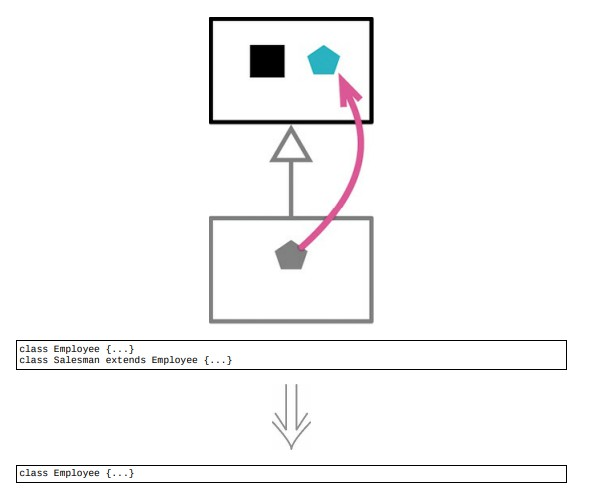

# 12.9 折叠继承体系



## 使用场景

- 一个类与其超类已经没多大差别，不值得作为独立的类存在的时候，就把超类和子类合并起来

- @Date: 2023-04-23 16:22:37

### 重构前

```java
class Employee
{
    ...
}

class Salesman extends Employee
{
    ...
}
```

### 重构后

```java
class Employee
{
    ...
}
```

## 重构完成🎀
