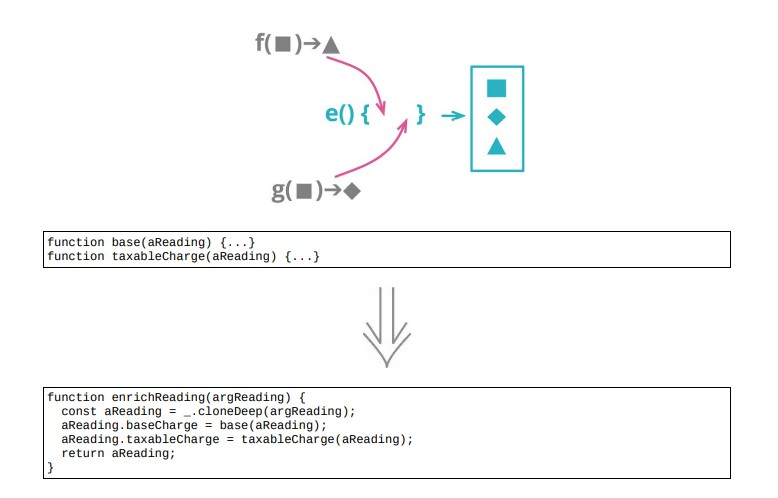

# 6.10 函数组合成变换



## 使用场景

- 如果修改了一项数据的值，就会导致数据不一致
- 建议使用函数组合成类方法

### 重构前

```java
reading = {customer : "ivan", quantity : 10, month : 5, year : 2017};
```

- `client 1`
收取基本费用

```java
const aReading = acquireReading();
const baseCharge = baseRate(aReading.month, aReading.year)aReading.quantity;
```

- `client 2`
基本费用 + 超出基本费用的部分要交税

```java
const aReading = acquireReading();
const base = (baseRate(aReading.month, aReading.year)aReading.quantity);
const taxableCharge = Math.max(0, base - taxThreshold(aReading.year));
```

- `client 3`
提炼计算基本费用的函数

```java
const aReading = acquireReading();
const basicChargeAmount = calculateBaseCharge(aReading);
function calculateBaseCharge(aReading)
{
    return baseRate(aReading.month, aReading.year)aReading.quantity;
}
```

### STEP1. 创建一个变换函数：复制输入的对象

```java
function enrichReading(original)
{
    const result = _.cloneDeep(original);
    return result;
}
```

### STEP2. 将 `calculateBaseCharge()` 搬移到变换函数中

```java
function enrichReading(original)
{
    const result = _.cloneDeep(original);
    result.baseCharge = calculateBaseCharge(result);
    return result;
}
function calculateBaseCharge(aReading)
{
    return baseRate(aReading.month, aReading.year)aReading.quantity;
}
```

- 修改 `client 3`，让他使用增强后的 `areading` 字段

```java
const rawReading = acquireReading();
const aReading = enrichReading(rawReading);
const basicChargeAmount = aReading.baseCharge;
```

- 修改 `client 1`

```java
const rawReading = acquireReading();
const aReading = enrichReading(rawReading); // aReading 的命名 = accumulationg variable，累计变量，当更多的逻辑搬移到变换函数中
const baseCharge = aReading.baseCharge;     // 考虑使用内联变量去掉baseCharge
```

### STEP3. 修改计算应税费用的逻辑

```java
const rawReading = acquireReading();
const aReading = enrichReading(rawReading);
const base = aReading.baseCharge;
const taxableCharge = Math.max(0, base - taxThreshold(aReading.year));
```

- 用内联变量去掉 `base` 变量

```java
const rawReading = acquireReading();
const aReading = enrichReading(rawReading);
const taxableCharge = Math.max(0, aReading.baseCharge - taxThreshold(aReading.year));
```

- 将 `taxableCharge` 函数搬到变换函数内

```java
function enrichReading(original)
{
    const result = _.cloneDeep(original);
    result.baseCharge = calculateBaseCharge(result);
    result.taxableCharge = Math.max(0, result.baseCharge - taxThreshold(result.year));
    return result;
}
```

### STEP4. 将计算税的逻辑搬移到变换函数中

- 修改 `client 2`，让他使用新添的字段

```java
const rawReading = acquireReading();
const aReading = enrichReading(rawReading);
const taxableCharge = aReading.taxableCharge; // 使用变换函数的累计字段的增强功能

function enrichReading(original)
{
    const result = _.cloneDeep(original);
    result.baseCharge = calculateBaseCharge(result);
    result.taxableCharge = Math.max(0, result.baseCharge - taxThreshold(result.year)); // NOTE: 搬运到变换函数中
    return result;
}
```

### STEP5. 使用内联变量将taxableCharge变量去掉

```java
const rawReading = acquireReading();
const aReading = enrichReading(rawReading);
// const taxableCharge = aReading.taxableCharge;
```

### 重构后

```java
function enrichReading(original)
{
    const result = _.cloneDeep(original);
    result.baseCharge = calculateBaseCharge(result);
    result.taxableCharge = Math.max(0, result.baseCharge - taxThreshold(result.year));
    return result;
}

// client 1
const rawReading = acquireReading();
const aReading = enrichReading(rawReading); // aReading 的命名 = accumulationg variable，累计变量，当更多的逻辑搬移到变换函数中

// client 3
const rawReading = acquireReading();
const aReading = enrichReading(rawReading);
```

## 重构完成🎀
