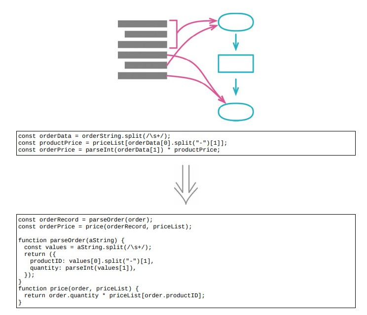

# 6.11 拆分阶段



## 使用场景

- 一段代码在同时处理两件不同的事情，可以拆分成各自独立的模块

### 重构前

```java
function priceOrder(product, quantity, shippingMethod)
{
    // 1. 计算订单中与商品相关的价格
    const basePrice = product.basePrice *quantity;
const discount = Math.max(quantity - product.discountThreshold, 0)* product.basePrice * product.discountRate;

    // 2. 根据 shipping 信息计算配送成本
    const shippingPerCase = (basePrice > shippingMethod.discountThreshold)
                                ? shippingMethod.discountedFee
                                : shippingMethod.feePerCase;
    const shippingCost = quantity * shippingPerCase;

    const price = basePrice - discount + shippingCost;
    return price;
}
```

### STEP1. 提炼函数

```java
function priceOrder(product, quantity, shippingMethod)
{
    const basePrice = product.basePrice *quantity;
const discount = Math.max(quantity - product.discountThreshold, 0)* product.basePrice * product.discountRate;
    const price = applyShipping(basePrice, shippingMethod, quantity, discount);
    return price;
}
```

- 将计算配送成本的逻辑提炼出来

```java
function applyShipping(basePrice, shippingMethod, quantity, discount)
{
    const shippingPerCase = (basePrice > shippingMethod.discountThreshold)
                                ? shippingMethod.discountedFee
                                : shippingMethod.feePerCase;
    const shippingCost = quantity * shippingPerCase;
    const price = basePrice - discount + shippingCost;
    return price;
}
```

### STEP2. 引入一个中转数据结构 `priceData` ，在两阶段之间沟通信息

- 检查 `applyShipping` 中的各个参数：
- 1. `basePrice` ：是在第一阶段中创建的，移入 `priceData`
- 2. `shippingMethod` ：第一阶段中没有使用这项数据，保留原样
- 3. `quantity` ：在第一阶段用到，但是不是在第一阶段中创建的，可以保留，但作者 prefer 将更多的参数搬移到中转数据结构中
- 4. `discount` ：在第一阶段中创建，移入中转数据结构中

```java
function priceOrder(product, quantity, shippingMethod)
{
    const basePrice = product.basePrice * quantity;
    const discount = Math.max(quantity - product.discountThreshold, 0) * product.basePrice * product.discountRate;
    const priceData = {basePrice : basePrice, quantity : quantity, discount : discount};
    const price = applyShipping(priceData, shippingMethod);
    return price;
}
```

- 修改 `applyShipping` 的入参

```java
function applyShipping(priceData, shippingMethod, discount)
{
    const shippingPerCase = (priceData.basePrice > shippingMethod.discountThreshold)
                                ? shippingMethod.discountedFee
                                : shippingMethod.feePerCase;
    const shippingCost = priceData.quantity * shippingPerCase;
    const price = priceData.basePrice - priceData.discount + shippingCost;
    return price;
}
```

### STEP3. 将第一阶段代码提炼成独立的函数，返回中转数据结构

```java
function priceOrder(product, quantity, shippingMethod)
{
    const priceData = calculatePricingData(product, quantity);
    const price = applyShipping(priceData, shippingMethod);
    return price;
}
function calculatePricingData(product, quantity)
{
    const basePrice = product.basePrice * quantity;
    const discount = Math.max(quantity - product.discountThreshold, 0) * product.basePrice * product.discountRate; // 可内联消除变量
    return {basePrice : basePrice, quantity : quantity, discount : discount};
}
function applyShipping(priceData, shippingMethod)
{
    const shippingPerCase = (priceData.basePrice > shippingMethod.discountThreshold)
                                ? shippingMethod.discountedFee
                                : shippingMethod.feePerCase;
    const shippingCost = priceData.quantity * shippingPerCase;
    const price = priceData.basePrice - priceData.discount + shippingCost; // 可内联消除变量
    return price;
}
```

### STEP4. 内联消除多余的 `const` 变量

```java
function priceOrder(product, quantity, shippingMethod)
{
    const priceData = calculatePricingData(product, quantity);
    return applyShipping(priceData, shippingMethod);
}
function calculatePricingData(product, quantity)
{
    const basePrice = product.basePrice * quantity;
    const discount = Math.max(quantity - product.discountThreshold, 0) * product.basePrice * product.discountRate;
    return {basePrice : basePrice, quantity : quantity, discount : discount};
}
function applyShipping(priceData, shippingMethod)
{
    const shippingPerCase = (priceData.basePrice > shippingMethod.discountThreshold)
                                ? shippingMethod.discountedFee
                                : shippingMethod.feePerCase;
    const shippingCost = priceData.quantity * shippingPerCase;
    return priceData.basePrice - priceData.discount + shippingCost;
}
```

## 重构完成🎀
