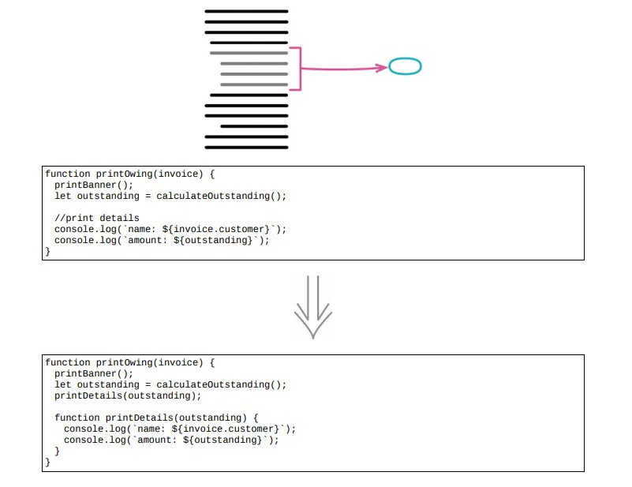

# 6.1 提炼函数



> [反向重构：6.2 内联函数](./6.2_inline_function_md))

> [示例 1]()
>
> [示例 2. 有局部变量]()
>
> [示例 3. 对局部变量再赋值]()
>
## 使用场景

- 合适应该把代码放进独立的函数：如果需要花一点时间才能弄清这个函数在干什么的话，就应该提炼到一个新函数中

## 示例 1

### 重构前

```java
function printOwing(invoice)
{
    let outstanding = 0;
    console.log("***********************");
    console.log("**** Customer Owes ****");
    console.log("***********************");
    // calculate outstanding
    for (const o of invoice.orders)
    {
        outstanding += o.amount;
    }
    // record due date
    const today = Clock.today;
    invoice.dueDate = new Date(today.getFullYear(), today.getMonth(), today.getDate() + 30);
    //print details
    console.log(`name: ${invoice.customer}`);
    console.log(`amount: ${outstanding}`);
    console.log(`due: ${invoice.dueDate.toLocaleDateString()}`);
}
```

### STEP1. 提炼出“打印横幅”的代码

```java
function printOwing(invoice)
{
    let outstanding = 0;
    printBanner();
    // calculate outstanding
    for (const o of invoice.orders)
    {
        outstanding += o.amount;
    }
    // record due date
    const today = Clock.today;
    invoice.dueDate = new Date(today.getFullYear(), today.getMonth(), today.getDate() + 30);
    //print details
    console.log(`name: ${invoice.customer}`);
    console.log(`amount: ${outstanding}`);
    console.log(`due: ${invoice.dueDate.toLocaleDateString()}`);
}
// NOTE
function printBanner()
{
    console.log("***********************");
    console.log("**** Customer Owes ****");
    console.log("***********************");
}
```

- 同样提炼“打印详细信息”部分

```java
function printOwing(invoice)
{
    let outstanding = 0;
    printBanner();
    // calculate outstanding
    for (const o of invoice.orders)
    {
        outstanding += o.amount;
    }
    // record due date
    const today = Clock.today;
    invoice.dueDate = new Date(today.getFullYear(), today.getMonth(), today.getDate() + 30);
    printDetails();
}
// NOTE
function printDetails()
{
    console.log(`name: ${invoice.customer}`);
    console.log(`amount: ${outstanding}`);
    console.log(`due: ${invoice.dueDate.toLocaleDateString()}`);
}

```

## 示例 2. 有局部变量

### 重构前

```java
function printOwing(invoice)
{
    let outstanding = 0;
    printBanner();
    // calculate outstanding
    for (const o of invoice.orders)
    {
        outstanding += o.amount;
    }
    // record due date
    const today = Clock.today;
    invoice.dueDate = new Date(today.getFullYear(), today.getMonth(), today.getDate() + 30);
    //print details
    console.log(`name: ${invoice.customer}`);
    console.log(`amount: ${outstanding}`);
    console.log(`due: ${invoice.dueDate.toLocaleDateString()}`);
}
```

### STEP1. `print detail` 这一部分提炼为带两个参数的函数

```java
function printOwing(invoice)
{
    let outstanding = 0;
    printBanner();
    // calculate outstanding
    for (const o of invoice.orders) {
    outstanding += o.amount;
    }
    // record due date
    const today = Clock.today;
    invoice.dueDate = new Date(today.getFullYear(), today.getMonth(), today.getDate() + 30);
    printDetails(invoice, outstanding);
}
function printDetails(invoice, outstanding)
{
    console.log(`name: ${invoice.customer}`);
    console.log(`amount: ${outstanding}`);
    console.log(`due: ${invoice.dueDate.toLocaleDateString()}`);
}
```

## 示例 3. 对局部变量再赋值

### 重构前

```java
function printOwing(invoice)
{
    let outstanding = 0;
    printBanner();
    // calculate outstanding
    for (const o of invoice.orders)
    {
        outstanding += o.amount;
    }
    recordDueDate(invoice);
    printDetails(invoice, outstanding);
}
```

### STEP1. 将变量声明移动到使用处之前

```java
function printOwing(invoice)
{
    printBanner();
    // calculate outstanding
    // NOTE
    let outstanding = 0;
    for (const o of invoice.orders)
    {
        outstanding += o.amount;
    }
    recordDueDate(invoice);
    printDetails(invoice, outstanding);
}
```

### STEP2. 将想要提炼的代码复制到目标函数中

```java
function printOwing(invoice)
{
    printBanner();
    // calculate outstanding
    let outstanding = 0;
    for (const o of invoice.orders)
    {
        outstanding += o.amount;
    }
    recordDueDate(invoice);
    printDetails(invoice, outstanding);
}

function calculateOutstanding(invoice)
{
    let outstanding = 0;
    for (const o of invoice.orders)
    {
        outstanding += o.amount;
    }
    return outstanding;
}
```

### STEP3. 修改原来的代码，零其调用新函数

```java
function printOwing(invoice)
{
    printBanner();
    let outstanding = calculateOutstanding(invoice);
    recordDueDate(invoice);
    printDetails(invoice, outstanding);
}
function calculateOutstanding(invoice)
{
    let outstanding = 0;
    for (const o of invoice.orders)
    {
        outstanding += o.amount;
    }
    return outstanding;
}
```

- 修改返回值的名字，使其符合一贯的风格

- 顺手将原来的 `outstanding` 变量声明成 `const，` 零它在初始化之后不能再次被赋值

```java
function printOwing(invoice)
{
    printBanner();
    // NOTE
    const outstanding = calculateOutstanding(invoice);
    recordDueDate(invoice);
    printDetails(invoice, outstanding);
}
function calculateOutstanding(invoice)
{
    // NOTE
    let result = 0;
    for (const o of invoice.orders)
    {
        result += o.amount;
    }
    return result;
}


```

## 重构完成🎀
