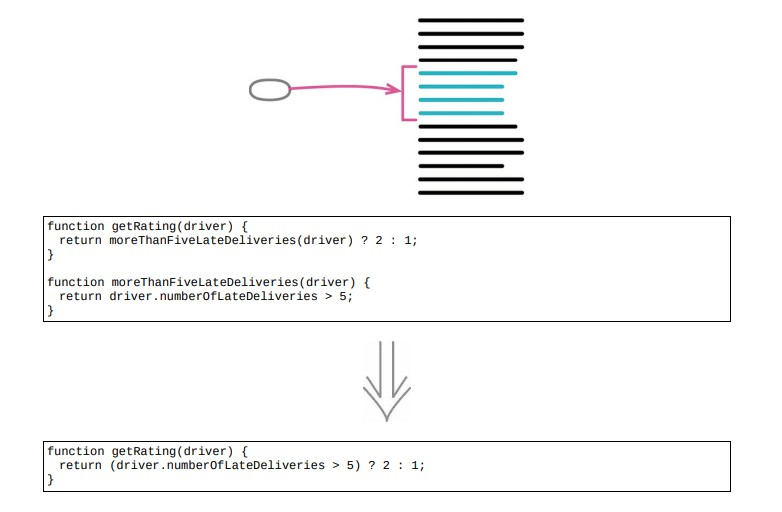

# 6.2 内联函数



> [反向重构：6.1 提炼函数](./6.1_extract_function.md)

## 使用场景

- 间接性可能会带来帮助，但是非必要的间接性总是让人不舒服

## 示例 1. 简单的例子

### 重构前

```java
function rating(aDriver)
{
    return moreThanFiveLateDeliveries(aDriver) ? 2 : 1;
}
function moreThanFiveLateDeliveries(aDriver)
{
    return aDriver.numberOfLateDeliveries > 5;
}
```

### 重构后

- 直接将被调用的 return 语句复制出来，粘贴到调用处

```java
function rating(aDriver)
{
    return aDriver.numberOfLateDeliveries > 5 ? 2 : 1;
```

## 示例 2. 稍微复杂

### 重构前

- 函数的声明的形参与调用出使用的变量名不同

```java
function rating(aDriver)
{
    return moreThanFiveLateDeliveries(aDriver) ? 2 : 1;
}
function moreThanFiveLateDeliveries(dvr)
{
    return dvr.numberOfLateDeliveries > 5;
}
```

### 重构后

```java
function rating(aDriver)
{
    return aDriver.numberOfLateDeliveries > 5 ? 2 : 1;
}
```

## 示例 3. 更复杂一点

### 重构前

```java
function reportLines(aCustomer)
{
    const lines = [];
    gatherCustomerData(lines, aCustomer);
    return lines;
}
function gatherCustomerData(out, aCustomer)
{
    out.push(["name", aCustomer.name]);
    out.push(["location", aCustomer.location]);
}
```

### 重构后

```java
function reportLines(aCustomer)
{
    const lines = [];
    lines.push(["name", aCustomer.name]);
    lines.push(["location", aCustomer.location]);
    return lines;
}
```

## 重构完成🎀
