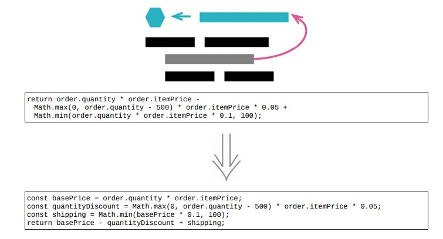

# 6.3 提炼变量



> [反向重构：6.4 内联变量](./6.4_inline_variable.md)

> [示例 1. 一个简单的例子]()
>
> [示例 2. 在一个类中]()

## 使用场景

- 表达式有可能非常复杂而难以阅读

- 局部变量可以帮助我们将表达式分解为比较容易管理的形式

## 示例 1. 一个简单的例子

### 重构前

```java
function price(order)
{
    //price is base price - quantity discount + shipping
    return order.quantity * order.itemPrice -
            Math.max(0, order.quantity - 500) * order.itemPrice * 0.05 +
            Math.min(order.quantity * order.itemPrice * 0.1, 100);
}
```

### 重构后

```java
function price(order)
{
    const basePrice = order.quantity * order.itemPrice;
    const quantityDiscount = Math.max(0, order.quantity - 500) * order.itemPrice * 0.05;
    const shipping = Math.min(basePrice * 0.1, 100);
    return basePrice - quantityDiscount + shipping;
}
```

## 示例 2. 在一个类中

### 重构前

```java
class Order
{
    constructor(aRecord)
    {
        this._data = aRecord;
    }
    get quantity() {return this._data.quantity;}
    get itemPrice() {return this._data.itemPrice;}
    get price() {return this.quantity * this.itemPrice -
    Math.max(0, this.quantity - 500) * this.itemPrice * 0.05 +
    Math.min(this.quantity * this.itemPrice * 0.1, 100);
    }
}
```

### STEP1. 这些变量名所代表的概念，适用于整个 Order 类，与其提炼成变量，不如提炼成方法

```java
class Order
{
    constructor(aRecord)
    {
        this._data = aRecord;
    }
    get quantity() {return this._data.quantity;}
    get itemPrice() {return this._data.itemPrice;}
    get price()
    {
        return this.basePrice - this.quantityDiscount + this.shipping;
    }
    // NOTE
    get basePrice() {return this.quantity * this.itemPrice;}
    get quantityDiscount() {return Math.max(0, this.quantity - 500) * this.itemPrice * 0.05;}
    get shipping() {return Math.min(this.basePrice * 0.1, 100);}
}
```

## 重构完成🎀
