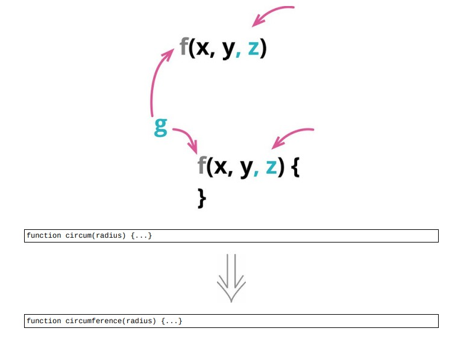

# 6.5 改变函数声明



## 使用方法

- 函数命名：函数的用途

- 函数参数：函数与外界的交互

## 示例 1. 一个简单的例子

### 重构前

```java
function circum(radius)
{
    return 2 * Math.PI * radius;
}
```

### 重构后

```java
function circum(radius)
{
    return circumference(radius);
}
function circumference(radius)
{
    return 2 * Math.PI * radius;
}
```

## 示例 2. 添加参数

### 重构前

```java
class Book
{
    addReservation(customer)
    {
        this._reservations.push(customer);
    }
}
```

- 给 addReservation 添加一个额外的参数

```java
class Book
{
    addReservation(customer)
    {
        this.zz_addReservation(customer);
    }
    zz_addReservation(customer)
    {
        this._reservations.push(customer);
    }
}
```

- 在新函数的声明中增加参数，同时修改旧函数中调用新函数的地方

```java
class Book
{
    addReservation(customer)
    {
        this.zz_addReservation(customer, false);
    }
    zz_addReservation(customer, isPriority)
    {
        this._reservations.push(customer);
    }
}
```

### 重构后

```java
class Book
{
    addReservation(customer, isPriority)
    {
        assert(isPriority === true || isPriority === false);
        this._reservations.push(customer);
    }
}
```

## 重构完成🎀
