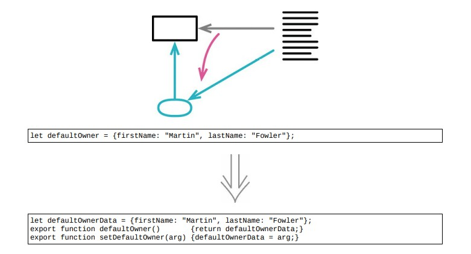

# 6.6 封装变量



## 使用场景

### 重构前

- 全局变量 defaultOwner中保存了一些有用的数据

```java
let defaultOwner = {firstName : "Martin", lastName : "Fowler"};
```

- defaultOwner是这样被使用的

```java
spaceship.owner = defaultOwner;
```

- defaultOwner是这样更新的

```java
defaultOwner = {firstName : "Rebecca", lastName : "Parsons"};
```

### STEP1. 定义读取和写入这段数据的函数，做个基础封装

```java
function getDefaultOwner() { return defaultOwner; }
function setDefaultOwner(arg) { defaultOwner = arg; }
```java
### STEP2. 处理使用defaultOwner的代码

```java
// 每看见一处引用该数据的代码，就将其改为调用取值函数
spaceship.owner = getDefaultOwner();

// 每看见一处给变量赋值的代码，就将其改为调用设置函数
setDefaultOwner({firstName : "Rebecca", lastName : "Parsons"});
```

- 前面值封装了对最外层数据的引用

### STEP3. 深入封装，控制对变量内容的修改

```java
let defaultOwnerData = {firstName : "Martin", lastName : "Fowler"};
export function defaultOwner()
{
    return new Person(defaultOwnerData);
}
export function setDefaultOwner(arg)
{
    defaultOwnerData = arg;
}
class Person
{
    constructor(data)
    {
        this._lastName = data.lastName;
        this._firstName = data.firstName
    }
    get lastName() { return this._lastName; }
    get firstName() { return this._firstName; }
    // and so on for other properties
}
```

## 重构完成🎀
