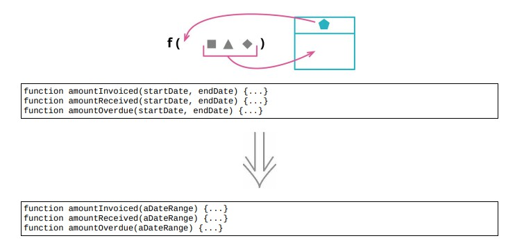

# 6.8 引入参数对象



## 使用场景

- 将数据组织成结构
- 使用心得数据结构，将会缩短参数的参数列表

### 重构前

```java
// 温度读数的数据
const station = {
    name : "ZB1",
    readings : [
        {temp : 47, time : "2016-11-10 09:10"},
        {temp : 53, time : "2016-11-10 09:20"},
        {temp : 58, time : "2016-11-10 09:30"},
        {temp : 53, time : "2016-11-10 09:40"},
        {temp : 51, time : "2016-11-10 09:50"},
    ]
};

// 找出指定范围的温度读数
function readingsOutsideRange(station, min, max)
{
    return station.readings
        .filter(r = > r.temp < min || r.temp > max);
}

// 调用方
alerts = readingsOutsideRange(
    station,
    operatingPlan.temperatureFloor,
    operatingPlan.temperatureCeiling);

```

- `调用方从operatingPlan中抽出了两个数据，将这两个数据传递` `readingOutsideRange`

这两项各不相干的数据来表示一个范围的情况，最好是将其组合成一个对象

### STEP1. 先为要组合的数据声明一个类

```java
class NumberRange
{
    constructor(min, max)
    {
        this._data = {min : min, max : max};
    }
    get min() { return this._data.min; }
    get max() { return this._data.max; }
}
```

- 调用方

```java
const range = new NumberRange(operatingPlan.temperatureFloor, operatingPlan.temperatureCeiling);
alerts = readingsOutsideRange(
    station,
    operatingPlan.temperatureFloor,
    operatingPlan.temperatureCeiling,
    range);
```

### STEP2. 修改使用参数的代码，将一堆参数变成一个对象

```java
function readingsOutsideRange(station, range)
{
    return station.readings.filter(r = > !range.contains(r.temp));
}

// 添加一个类函数
contains(arg) { return (arg >= this.min && arg <= this.max); }

// 调用方
const range = new NumberRange(operatingPlan.temperatureFloor, operatingPlan.temperatureCeiling);
alerts = readingsOutsideRange(station, range);
```

## 重构完成🎀
