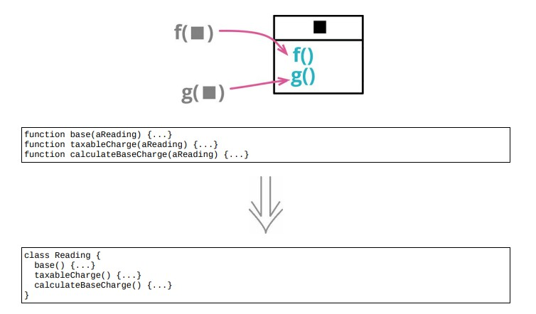

# 6.9 函数组合成类



## 使用场景

-如果一组函数形影不离的操作同一块数据，就可以将函数+数据捆绑到同一个类中

### 重构前

```java
reading = {customer : "ivan", quantity : 10, month : 5, year : 2017};
```

- client 1 收取基本费用

```java
const aReading = acquireReading();
const baseCharge = baseRate(aReading.month, aReading.year)aReading.quantity;
```

- client 2 基本费用 + 超出基本费用的部分要交税

```java
const aReading = acquireReading();
const base = (baseRate(aReading.month, aReading.year)aReading.quantity);
const taxableCharge = Math.max(0, base - taxThreshold(aReading.year));
```

- client 3 提炼计算基本费用的函数

```java
const aReading = acquireReading();
const basicChargeAmount = calculateBaseCharge(aReading);
function calculateBaseCharge(aReading)
{
    return baseRate(aReading.month, aReading.year)aReading.quantity;
}
```

### STEP1. 封装记录将记录变成类

```java
class Reading
{
    constructor(data)
    {
        this._customer = data.customer;
        this._quantity = data.quantity;
        this._month = data.month;
        this._year = data.year;
    }
    get customer() { return this._customer; }
    get quantity() { return this._quantity; }
    get month() { return this._month; }
    get year() { return this._year; }
}
```

### STEP2. 用搬移函数将 calculateBaseCharge 搬到新类中

```java
get calculateBaseCharge()
{
    return baseRate(this.month, this.year)this.quantity;
}

// 函数改名，按照喜欢的风格改名
get baseCharge()
{
    return baseRate(this.month, this.year)this.quantity;
}

// 此时的 client 3
const rawReading = acquireReading();
const aReading = new Reading(rawReading);
const basicChargeAmount = aReading.baseCharge;

// client 1
const rawReading = acquireReading();
const aReading = new Reading(rawReading);
const baseCharge = aReading.baseCharge;

// client 2
const rawReading = acquireReading();
const aReading = new Reading(rawReading);
const taxableCharge = Math.max(0, aReading.baseCharge - taxThreshold(aReading.year));
```

### STEP3. 用提炼函数将taxablecharge的逻辑提炼成函数

```java
function taxableChargeFn(aReading)
{
    return Math.max(0, aReading.baseCharge - taxThreshold(aReading.year));
}

// 搬移函数搬到Reading类中
get taxableCharge()
{
    return Math.max(0, this.baseCharge - taxThreshold(this.year));
}

// client3
const rawReading = acquireReading();
const aReading = new Reading(rawReading);
const taxableCharge = aReading.taxableCharge;
```

### 重构后

```java
class Reading
{
    constructor(data)
    {
        this._customer = data.customer;
        this._quantity = data.quantity;
        this._month = data.month;
        this._year = data.year;
    }
    get customer() { return this._customer; }
    get quantity() { return this._quantity; }
    get month() { return this._month; }
    get year() { return this._year; }
 
    get baseCharge()
    {
        return baseRate(this.month, this.year)this.quantity;
    }
    get taxableCharge()
    {
        return Math.max(0, this.baseCharge - taxThreshold(this.year));
    }

    // client 1
    const rawReading = acquireReading();
    const aReading = new Reading(rawReading);
    const baseCharge = aReading.baseCharge;

    // client 2
    const rawReading = acquireReading();
    const aReading = new Reading(rawReading);
    const taxableCharge = aReading.taxableCharge;

    // client3
    const rawReading = acquireReading();
    const aReading = new Reading(rawReading);
    const taxableCharge = aReading.taxableCharge;
}
```

## 重构完成🎀
