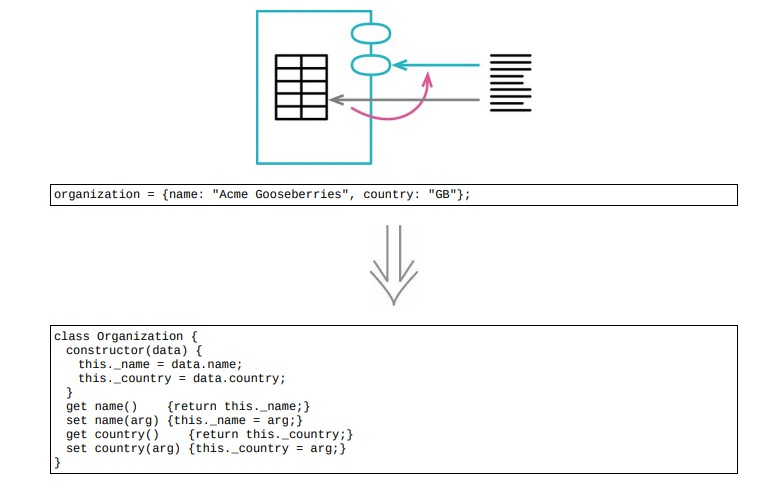

# 7.1 封装记录



## 使用场景

- 用散列 `hash` 、映射 `map` 、散列映射 `hashmap` 、字典 `dictionary`
或关联数组 `associative array` 等语言库本身的类实现，由于“数据结构不直观”会造成许多困扰

### 重构前

```java
// 一个被大量使用的常量
const organization = {name : "Acme Gooseberries", country : "GB"};

// 对这个常量进行读取和更新的地方
result += `<h1> ${organization.name}</ h1>`;
organization.name = newName;
```

### STEP1. 对持有记录的变量使用封装变量，将其封装到一个函数中

```java
function getRawDataOfOrganization() { return organization; }

// 读取变量
result += `<h1> ${getRawDataOfOrganization().name}</ h1>`;

// 更新变量
getRawDataOfOrganization().name = newName;
```

### STEP2

### 创建一个类，将记录包装起来，并将记录变量的值替换为该类的一个实例

### 然后再类上定义一个访问函数，用于返回原始的记录

### 修改封装变量的函数，令其使用这个访问函数

```java
class Organization
{
    constructor(data)
    {
        this._data = data;
    }
}

const organization = new Organization({name : "Acme Gooseberries", country : "GB"});
function getRawDataOfOrganization() { return organization._data; }
function getOrganization() { return organization; }

// 创建完对象，用一个设置函数来替换所有更新记录的地方
class Organization
{
    set name(aString)
    {
        this._data.name = aString;
    }
}

getOrganization()
    .name = newName; // client

// 用一个取值函数来替代所有读取记录的地方
class Organization
{
    get name() { return this._data.name; }
}

result += `<h1>
    ${getOrganization().name}</ h1>`; // client
```

### STEP3. 新建一个函数，让它返回该类的对象，而非原始的记录

```java
function getOrganization() { return organization; }
```

### STEP4. 将 _data 里的字段展开到对象，用一个 `constructor`

```java
class Organization
{
    constructor(data)
    {
        this._name = data.name;
        this._country = data.country;
    }
    get name() { return this._name; }
    set name(aString) { this._name = aString; }
    get country() { return this._country; }
    set country(aCountryCode) { this._country = aCountryCode; }
}
```

> 嵌套封装记录 还没看
