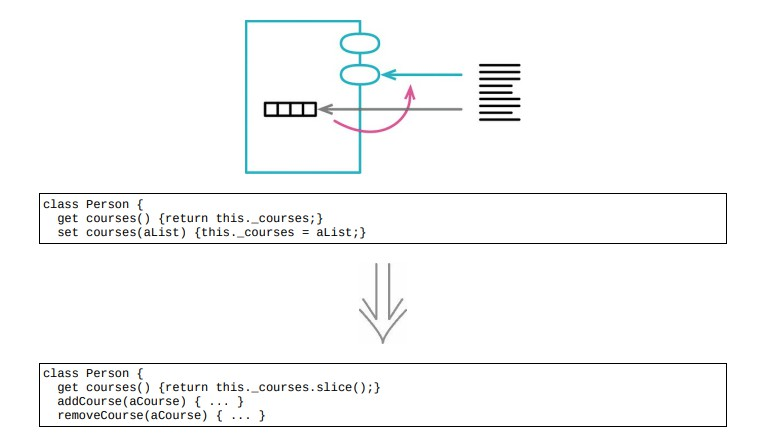

# 7.2 封装集合



## 使用场景

- 封装集合时常犯的错误：只对集合变量的访问进行了封装，但依然让取值函数返回集合本身
- 使集合的长远变量可以直接被修改，而封装他的类全然不知

### 重构前

```java
class Person
{
    constructor(name)
    {
        this._name = name;
        this._courses = [];
    }
    get name() { return this._name; }
    get courses() { return this._courses; }
    set courses(aList) { this._courses = aList; }
}

class Course
{
    constructor(name, isAdvanced)
    {
        this._name = name;
        this._isAdvanced = isAdvanced;
    }
    get name() { return this._name; }
    get isAdvanced() { return this._isAdvanced; }
}
```

- client

```java
numAdvancedCourses = aPerson.courses
                         .f ilter(c = &gt; c.isAdvanced)
                         .length;
```

- 对课程列表的封装还不完整，对列表整体的任何更新操作，都能通过设值函数得到控制

```java
const basicCourseNames = readBasicCourseNames(filename);
aPerson.courses = basicCourseNames.map(name = > new Course(name, false));
```

- 客户端通过直接更新课程列表显然更容易，就破坏了 `Person` 类的封装性

```java
for (const name of readBasicCourseNames(filename))
{
    aPerson.courses.push(new Course(name, false));
}
```

### STEP1. 为类添加两个方法，为客户端提供“添加课程”和“移除课程”的接口

```java
class Person
{
    addCourse(aCourse)
    {
        this._courses.push(aCourse);
    }
    removeCourse(
        aCourse, fnIfAbsent = () = > { throw new RangeError(); })
    {
        const index = this._courses.indexOf(aCourse);
        if (index == = -1)
            fnIfAbsent();
        else
            this._courses.splice(index, 1);
    }
}
```

- client

```java
for (const name of readBasicCourseNames(filename))
{
    aPerson.addCourse(new Course(name, false));
}
```

### STEP2. 通常 `setCourse` 设置函数就没必要存在了

### 方法1. 通过移除设置函数移除它

### 方法2. 如果没法移除，就提供一个设置方法作为API，至少要确保用一份副本给字段赋值，不去修改通过参数传入的集合

```java
class Person
{
    set courses(aList) { this._courses = aList.slice(); }
}
```

### STEP3. 只要可能改变集合，就返回一个副本

```java
class Person
{
    get courses() { return this._courses.slice(); }
}
```

### 重构后

```java
class Person
{
    constructor(name)
    {
        this._name = name;
        this._courses = [];
    }
    get name() { return this._name; }
    get courses() { return this._courses.slice(); }
    set courses(aList) { this._courses = aList.slice(); }
    addCourse(aCourse)
    {
        this._courses.push(aCourse);
    }
    removeCourse(
        aCourse, fnIfAbsent = () = > { throw new RangeError(); })
    {
        const index = this._courses.indexOf(aCourse);
        if (index == = -1)
            fnIfAbsent();
        else
            this._courses.splice(index, 1);
    }
}

class Course
{
    constructor(name, isAdvanced)
    {
        this._name = name;
        this._isAdvanced = isAdvanced;
    }
    get name() { return this._name; }
    get isAdvanced() { return this._isAdvanced; }
}
```

- client

```java
for (const name of readBasicCourseNames(filename))
{
    aPerson.addCourse(new Course(name, false));
}
```

## 重构完成🎀
