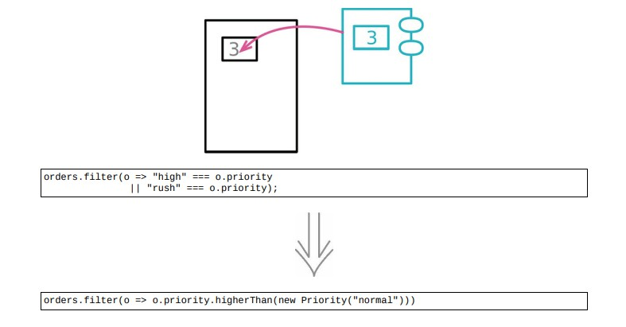

# 7.3 以对象取代基本类型



## 使用场景

- 一旦发现对某个数据的操作不仅仅局限于打印时，就会为它创建一个新类

- 小小的封装开始可能价值甚微，只有悉心照料，他们很快就能成为有用的工具

### 重构前

```java
class Order
{
    constructor(data)
    {
        this.priority = data.priority;
        // more initialization
    }
}
```

- client

```java
highPriorityCount = orders.filter(o = > "high" == = o.priority || "rush" == = o.priority)
                        .length;
```

### STEP1. 封装变量

```java
class Order
{
    constructor(data)
    {
        this.priority = data.priority;
        // more initialization
    }
    get priority() { return this._priority; }
    set priority(aString) { this._priority = aString; }
}
```

### STEP2. 为数据值创建一个类，类的构造函数应该保存这个数据值，并未它提供一个取值函数

```java
classs Priority
{
    constructor(value) { this._value = value; }
    toString() { return this._value; }
}
```

### STEP3. 修改访问函数，使其用上新创建的类

```java
class Order
{
    get priority() { return this._priority.toString(); }
    set priority(aString)
    {
        this._priority = new Priority(aString);
    }
}
```

- `get priority` 的名字有点忽悠人

```java
class Order
{
    get priorityString() { return this._priority.toString(); }
}
```

- client

```java
highPriorityCount = orders.filter(o = > "high" == = o.priorityString || "rush" == = o.priorityString)
                        .length;
```

### STEP4. 优化

- 让client直接使用 `Priority` 对象是否会更好

```java
class Order
{
    get priority() { return this._priority; }
    get priorityString() { return this._priority.toString(); }
    set priority(aString) { this._priority = new Priority(aString); }
}
```

- client

```java
highPriorityCount = orders.filter(o = > "high" == = o.priority.toString() || "rush" == = o.priority.toString())
                        .length;
```

- 让Order类的客户端拿着 `Priority` 实例来调用设置函数

```java
class Priority
{
    constructor(value)
    {
        if (value instanceof Priority)
            return value;
        this._value = value;
    }
}
```

- 让 `Priority` 类支持更多的业务行为

```java
class Priority
{
    constructor(value)
    {
        if (value instanceof Priority)
            return value;
        if (Priority.legalValues().includes(value))
            this._value = value;
        else
throw new Error(`<${value}> is invalid for Priority`);
    }
    toString() { return this._value; }
    get _index() { return Priority.legalValues().findIndex(s = > s == = this._value); }
    static legalValues() { return [ 'low', 'normal', 'high', 'rush' ]; }
    equals(other) { return this._index == = other._index; }
    higherThan(other) { return this._index > other._index; }
    lowerThan(other) { return this._index < other._index; }
}
```

- client

```java
highPriorityCount = orders.filter(o = > o.priority.higherThan(new Priority("normal")))
                        .length;
```

## 重构完成🎀
