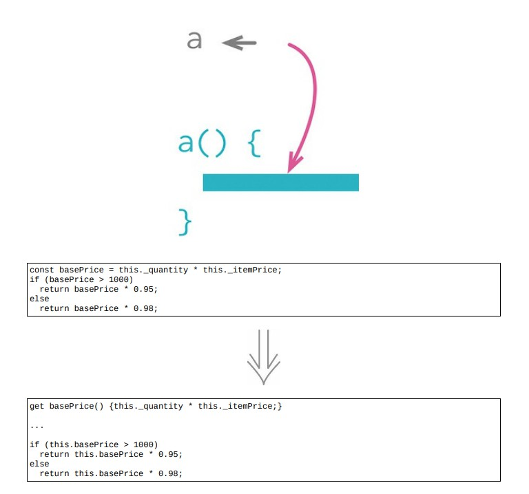

# 7.4 已查询取代临时变量

## 使用场景

### 重构前

```java
class Order
{
    constructor(quantity, item)
    {
        this._quantity = quantity;
        this._item = item;
    }
    get price()
    {
        var basePrice = this._quantity * this._item.price;
        var discountFactor = 0.98;
        if (basePrice > 1000)
            discountFactor -= 0.03;
        return basePrice * discountFactor;
    }
}
```

### STEP1. 将临时变量变成函数

```java
class Order
{
    constructor(quantity, item)
    {
        this._quantity = quantity;
        this._item = item;
    }
    get price()
    {
        const basePrice = this._quantity * this._item.price; // 先声明成const以供测试
        var discountFactor = 0.98;
        if (basePrice > 1000)
            discountFactor -= 0.03;
        return basePrice * discountFactor;
    }
}
```

- 然后将赋值操作的右边提炼成一个取值函数

```java
class Order
{
    get price()
    {
        const basePrice = this.basePrice;
        var discountFactor = 0.98;
        if (basePrice > 1000)
            discountFactor -= 0.03;
        return basePrice * discountFactor;
    }
    get basePrice()
    {
        return this._quantity * this._item.price;
    }
}
```

### STEP2. 使用内联变量

```java
class Order
{
    get price()
    {
        // const basePrice = this.basePrice;
        var discountFactor = 0.98;
        if (this.basePrice > 1000)
            discountFactor -= 0.03;
        return this.basePrice * discountFactor;
    }
}
```

### STEP3. 对 `discountFactor` 重复同样的步骤

```java
class Order
{
    get price()
    {
        return this.basePrice *this.discountFactor;
    }
    get basePrice()
    {
return this._quantity* this._item.price;
    }
    get discountFactor()
    {
        var discountFactor = 0.98;
        if (this.basePrice > 1000)
            discountFactor -= 0.03;
        return discountFactor;
    }
}
```

## 重构完成🎀
