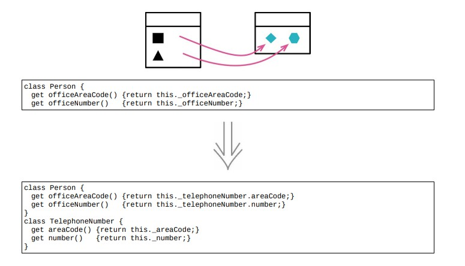

# 7.5 提炼类



> [反向重构：7.6 内联类](./7.6_inline_class.md)

### 重构前

```java
class Person
{
    get name() { return this._name; }
    set name(arg) { this._name = arg; }
    get telephoneNumber()
    {
        return `(${this.officeAreaCode})$ { this.officeNumber }
        `;
    }
    get officeAreaCode() { return this._officeAreaCode; }
    set officeAreaCode(arg) { this._officeAreaCode = arg; }
    get officeNumber() { return this._officeNumber; }
    set officeNumber(arg) { this._officeNumber = arg; }
}
```

### STEP1. 将与电话号码相关的行为分离到一个独立的类中

```java
class Person
{
    constructor()
    {
        this._telephoneNumber = new TelephoneNumber();
    }
}

class TelephoneNumber
{
    get officeAreaCode() { return this._officeAreaCode; }
    set officeAreaCode(arg) { this._officeAreaCode = arg; }
}
```

### STEP2. 搬移字段

```java
class Person
{
    get officeAreaCode() { return this._telephoneNumber.officeAreaCode; }
    set officeAreaCode(arg) { this._telephoneNumber.officeAreaCode = arg; }
}
```

### STEP3. 清理一下变量，电话号码不应该有办公室的概念

```java
class TelephoneNumber
{
    get areaCode() { return this._areaCode; }
    set areaCode(arg) { this._areaCode = arg; }
    get number() { return this._number; }
    set number(arg) { this._number = arg; }
}

class Person
{
    get officeAreaCode() { return this._telephoneNumber.areaCode; }
    set officeAreaCode(arg) { this._telephoneNumber.areaCode = arg; }
    get officeNumber() { return this._telephoneNumber.number; }
    set officeNumber(arg) { this._telephoneNumber.number = arg; }
}
```

### STEP4. `TelephoneNumber` 类中有一个 `get number` 也没什么道理，应用函数改名

```java
class TelephoneNumber
{
    toString()
    {
        return `(${this.areaCode})$ { this.number }
        `;
    }
}

class Person
{
    get telephoneNumber() {return this._telephoneNumber.toString();}
}
```

## 重构完成🎀
