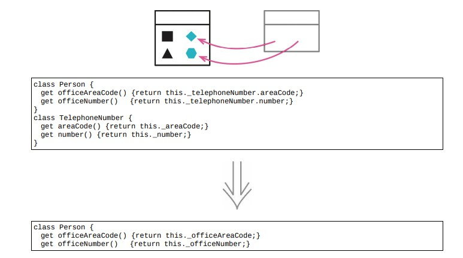

# 7.6 内联类



> [反向重构：7.5 提炼类](./7.5_extract_class.md)

## 使用场景

- 如果一个类不再承担足够责任，不再有单独存在的理由，就把这个类塞进另一个类中
- 如果有两个类，想重新安排他们的职责，并让他们产生关联：先内联成一个类，再用提炼类去分离其职责

### 重构前

```java
class TrackingInformation
{
    get shippingCompany() { return this._shippingCompany; }
    set shippingCompany(arg) { this._shippingCompany = arg; }
    get trackingNumber() { return this._trackingNumber; }
    set trackingNumber(arg) { this._trackingNumber = arg; }
    get display()
    {
        return `${this.shippingCompany} : $ { this.trackingNumber }
`;
    }
}

class Shipment
{
    get trackingInfo()
    {
        return this._trackingInformation.display;
    }
    get trackingInformation() { return this._trackingInformation; }
    set trackingInformation(aTrackingInformation)
    {
        this._trackingInformation = aTrackingInformation;
    }
}
```

- client

```java
aShipment.trackingInformation.shippingCompany = request.vendor;
```

### STEP1. 对于待内联类中的所有 `public` 函数，在目标类上创建一个对应的函数，新创建的所有函数应该直接委托至源类

```java
class Shipment
{
    set shippingCompany(arg) { this._trackingInformation.shippingCompany = arg; }
}
```

- client

```java
aShipment/*.trackingInformation*/.shippingCompany = request.vendor;
```

### STEP2. 对于 `TrackingInformation` 类中所有为客户端调用的方法，全都搬移到 `Shipment` 类中

- display

```java
class Shipment
{
    get trackInfo()
    {
        return `${this.shippingCompany} : $ { this.trackingNumber }
    }
}
```

- shipping company

```java
class Shipment
{
    get shippingCompany() { return this._trackingInformation._shippingCompany; }
    set shippingCompany(arg) { this._trackingInformation._shippingCompany = arg; }
}
```

### 重构后

```java
class Shipment
{
    get trackingInfo()
    {
        return `${this.shippingCompany} : $ { this.trackingNumber }
`;
    }
    get shippingCompany() { return this._shippingCompany; }
    set shippingCompany(arg) { this._shippingCompany = arg; }
    get trackingNumber() { return this._trackingNumber; }
    set trackingNumber(arg) { this._trackingNumber = arg; }
}
```

## 重构完成🎀
