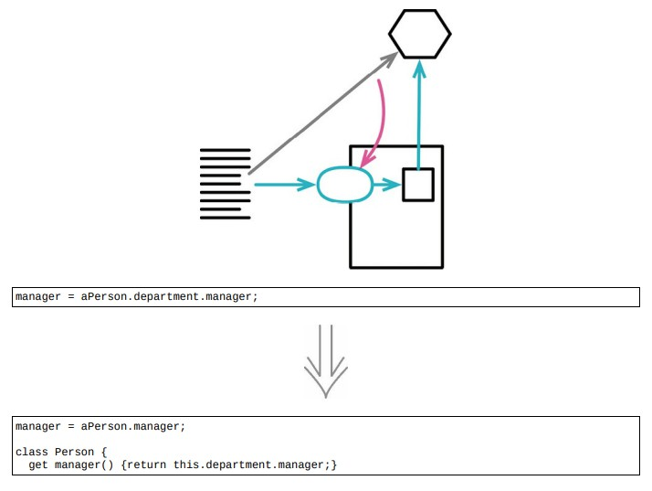

# 7.7 隐藏委托关系



> [反向重构：7.8 移除中间人](./7.8_remove_middle_man.md)

## 使用场景

- 如果某些客户端先通过服务对象的字段的到另一个对象(受托类)，然后调用后者的函数，那么客户就必须知晓这一层委托关系
- 如果受托类修改了接口，啧变化会波及通过服务对象使用它的所有客户端

### 重构前

```java
class Person
{
    constructor(name)
    {
        this._name = name;
    }
    get name() { return this._name; }
    get department() { return this._department; }
    set department(arg) { this._department = arg; }
}

class Department
{
    get chargeCode() { return this._chargeCode; }
    set chargeCode(arg) { this._chargeCode = arg; }
    get manager() { return this._manager; }
    set manager(arg) { this._manager = arg; }
}
```

- 当一个客户端希望知道一个 `person` 的经理，需要先取得 `Department` 对象

- 这样就暴露出 `Department` 的工作原理

- 考虑对 `client` 隐藏 `Department` ，减少耦合

```java
maneger = aPerson.department.manager;
```

### STEP1

```java
class Person
{
    get manager() { return this._department.manager; }
}
```

- 修改 `Person` 的所有客户端，让他们改用新manager函数

```java
manager = aPerson /*.department*/.manager;
```

### STEP2. 只要完成对 `Department` 所有函数的修改，并相应修改了 `Person` 的所有客户端，就可以移除 `Person` 中的 `department` 访问函数了

```java
class Person
{
    constructor(name)
    {
        this._name = name;
    }
    get name() { return this._name; }
    // get department() { return this._department; }
    get manager() { return this._department.manager; }
    set department(arg) { this._department = arg; }
}
```

## 重构完成🎀
