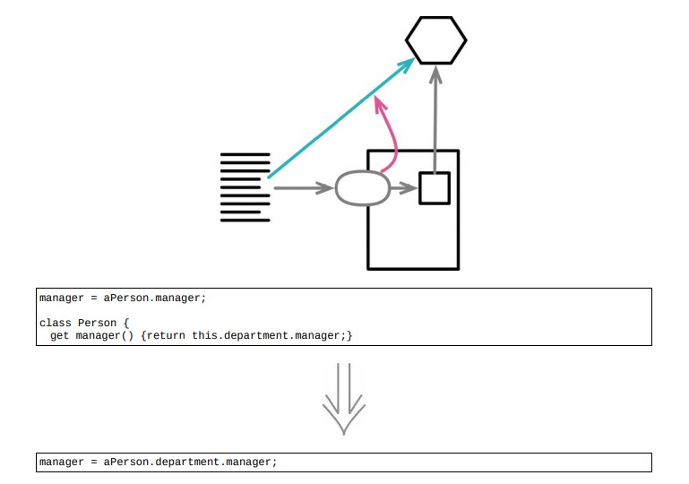

# 7.8 移除中间人



> [反向重构：隐藏委托关系](./7.7_hide_delegate.md)
>
## 使用场景

- 随着受托类的功能越来越多，就必须再服务端添加一个简单委托函数

### 重构前

- client

```java
manager = aPerson.manager;

class Person
{
    get manager() { return this._department.manager; }
}

class Department
{
    get manager() { return this._manager; }
}
```

### STEP1. 在 `Person` 中建立一个函数，用于获取受托对象

```java
class Person
{
    get department() { return this._department; }
}
```

### STEP2. 逐一处理每个客户端，是他们直接通过受托对象完成工作

```java
manager = aPerson.department.manager;
```

### STEP3. 移除 `Person` 类中 `manager` 委托方法
