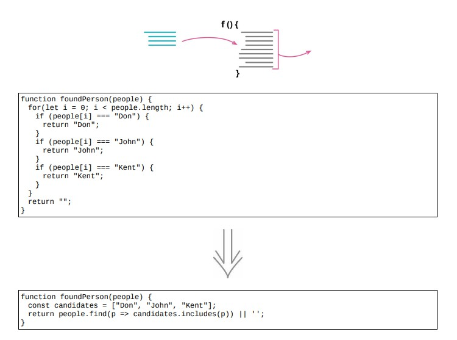

# 7.9 替换算法



## 使用场景

- 用清晰的方式取代复杂的方式，壮士断腕，删掉整个算法

### 重构前

```java
function foundPerson(people)
{
    for (let i = 0; i < people.length; i++)
    {
        if (people[i] == = "Don")
        {
            return "Don";
        }
        if (people[i] == = "John")
        {
            return "John";
        }
        if (people[i] == = "Kent")
        {
            return "Kent";
        }
    }
    return "";
}
```

### 重构后

```java
function foundPerson(people)
{
    const candidates = [ "Don", "John", "Kent" ];
    return people.find(p = > candidates.includes(p)) || '';
}
```

## 重构完成🎀
