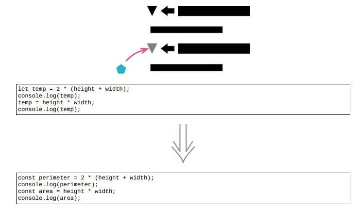

<!--
 * @Author: FEIFEI SUN
 * @Description: 
 * @Detail: 
 * @Date: 2023-04-24 14:16:00
 * 
-->
# 9.1 拆分变量



## 使用场景

- 循环变量：随循环的每次运行而改变

- 结果收集变量：将通过整个函数的运算而构成的个值收集起来

如果变量承担多个责任，他就应该被分解为多个变量。

> [示例 1.]()
>
> [示例 2. 对输入参数赋值]()

## 示例 1

### 重构前

- acc 变量被赋值两次

acc 变量由两个责任：

1. 保存第一个力造成的初始加速度

2. 保存两个里共同造成的加速度

```java
function distanceTravelled (scenario, time) 
{
    let result;
    let acc = scenario.primaryForce / scenario.mass;
    let primaryTime = Math.min(time, scenario.delay);
    result = 0.5 * acc * primaryTime * primaryTime;
    let secondaryTime = time - scenario.delay;
        if (secondaryTime > 0) 
        {
            let primaryVelocity = acc * scenario.delay;
            acc = (scenario.primaryForce + scenario.secondaryForce) / scenario.mass;
            result += primaryVelocity * secondaryTime + 0.5 * acc * secondaryTime * secondaryTime;
        }
    return result;
}
```

### STEP1

### 1. 在函数开始处修改 acc 变量的名称，并将新变量声明为 const

- 声明为 const 确保他只被赋值一次

### 2. 在对 acc 变量第二次赋值之前的全部对 acc 的引用替换为新变量

### 3. 在第二次赋值处重新声明 acc 变量

```java
function distanceTravelled (scenario, time)
{
    let result;
    // 1. 
    const primaryAcceleration = scenario.primaryForce / scenario.mass;
    let primaryTime = Math.min(time, scenario.delay);
    // 2.
    result = 0.5 * primaryAcceleration * primaryTime * primaryTime;
    let secondaryTime = time - scenario.delay;
    if (secondaryTime > 0)
    {
        // 2.
        let primaryVelocity = primaryAcceleration * scenario.delay;
        // 3.
        let acc = (scenario.primaryForce + scenario.secondaryForce) / scenario.mass;
        result += primaryVelocity * secondaryTime + 0.5 * acc * secondaryTime * secondaryTime;
    }
    return result;
}
```

### STEP2. 处理 acc 变量的第二次赋值

```JAVA
function distanceTravelled (scenario, time)
{
    let result;
    const primaryAcceleration = scenario.primaryForce / scenario.mass;
    let primaryTime = Math.min(time, scenario.delay);
    result = 0.5 * primaryAcceleration * primaryTime * primaryTime;
    let secondaryTime = time - scenario.delay;
    if (secondaryTime > 0)
    {
        let primaryVelocity = primaryAcceleration * scenario.delay;
        // acc = secondaryAcceleration
        const secondaryAcceleration = (scenario.primaryForce + scenario.secondaryForce) / scenario.
        mass;
        result += primaryVelocity * secondaryTime +
        0.5 * secondaryAcceleration * secondaryTime * secondaryTime;
    }
    return result;
}
```

## 示例 2. 对输入参数赋值

### 重构前

- inputValue 有两个用途

1. 函数的输入

2. 负责把结果带回给调用方

```java
function discount (inputValue, quantity)
{
    if (inputValue > 50)
        inputValue = inputValue - 2;
    if (quantity > 100)
        inputValue = inputValue - 1;
    return inputValue;
}
```

### STEP1. 对 inputValue 变量做拆分

```java
function discount (originalInputValue, quantity)
{
    let inputValue = originalInputValue;
    if (inputValue > 50)
        inputValue = inputValue - 2;
    if (quantity > 100)
        inputValue = inputValue - 1;
    return inputValue;
}
```

### STEP2. 使用变量改名给两个变量换上好名字

```java
function discount (inputValue, quantity)
{
    let result = inputValue;
    if (inputValue > 50)
        result = inputValue - 2;
    if (quantity > 100)
        result = inputValue - 1;
    return result;
}
```

### 重构完成🎀
