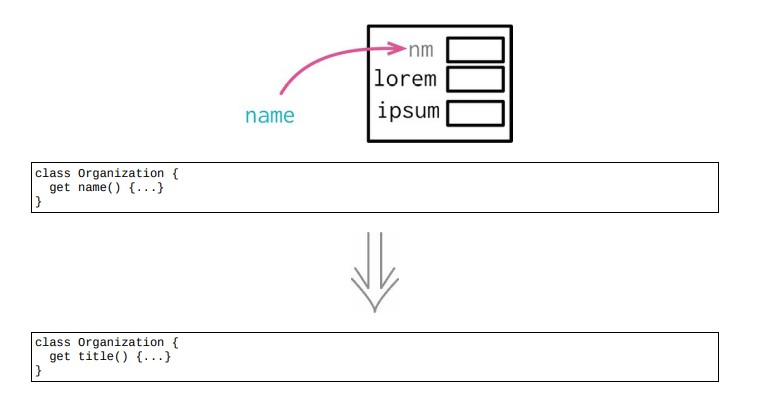

<!--
 * @Author: FEIFEI SUN
 * @Description: 
 * @Detail: 
 * @Date: 2023-04-24 14:16:23
 * 
-->
# 9.2 字段改名



## 使用场景

- 理解程序行为的关键：

1. 流程图

2. 数据结构

3. 记录结构中的字段：取值 & 设置

## 示例 1. 给字段改名：先从常量开始

### 重构前

```java
const organization = {name: "Acme Gooseberries", country: "GB"};
```

## 目的: 把 name 改名为 title

### STEP1. 封装记录

- 因为这个字段被很多地方使用，有些代码会更新name字段，所以先用[封装记录](../Chapter_7/7.1_encapsulate_record.md)，把这个记录封装起来

```java
class Organization
{
    constructor(data)
    {
        this._name = data.name;
        this._country = data.country;
    }
    get name() {return this._name;}
    set name(aString) {this._name = aString;}
    get country() {return this._country;}
    set country(aCountryCode) {this._country = aCountryCode;}
}

const organization = new Organization({name: "Acme Gooseberries", country: "GB"});
```

### STEP2. 修改内部数据结构

字段改名有 4 个地方需要留意：

1. 取值函数

2. 设值函数

3. 构造函数

4. 内部数据结构

```java
class Organization
{
    constructor(data)
    {
        this._title = data.name;
        this._country = data.country;
    }
    get name() {return this._title;}
    set name(aString) {this._title = aString;}
    get country() {return this._country;}
    set country(aCountryCode) {this._country = aCountryCode;}
}
```

### STEP3. 修改构造函数

- 此时构造函数的调用者既可以使用 name 也可以使用 title

```java
class Organization
{
    constructor(data)
    {
        this._title = (data.title !== undefined) ? data.title : data.name;
        this._country = data.country;
    }
    get name() {return this._title;}
    set name(aString) {this._title = aString;}
    get country() {return this._country;}
    set country(aCountryCode) {this._country = aCountryCode;}
}
```

### STEP4. 在构造函数中去掉对 name 的支持

```java
class Organization
{
    constructor(data)
    {
        this._title = data.title;
        this._country = data.country;
    }
    get name() { return this._title; }
    set name(aString) {this._title = aString;}
    get country() { return this._country; }
    set country(aCountryCode) { this._country = aCountryCode; }
}
```

### STEP5. 给访问函数运用[函数改名](../Chapter_6/6.5_change_function_declaration.md)

```java
class Organization
{
    constructor(data)
    {
        this._title = data.title;
        this._country = data.country;
    }
    get title() { return this._title; }
    set title(aString) { this._title = aString; }
    get country() { return this._country;}
    set country(aCountryCode) { this._country = aCountryCode; }
}
```

### 重构完成🎀
