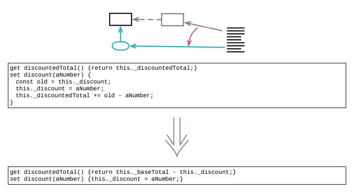

<!--
 * @Author: FEIFEI SUN
 * @Description: 
 * @Detail: 
 * @Date: 2023-04-24 14:16:53
 * 
-->
# 9.3 以查询取代派生变量



## 使用场景

- 可变数据是软件中最大的错误源头之一

- 在一处修改数据，却在另一处造成难以发现的破坏

- 强烈建议：尽量把可变数据的作用域限制在最小范围

## 示例 1. 完美的展示了代码的丑陋

### 重构前

```java
get production() {return this._production;}

applyAdjustment(anAdjustment)
{
    this._adjustments.push(anAdjustment);
    this._production += anAdjustment.amount;
}
```

### 重构后

```java
get production()
{
    return this._adjustments
                .reduce((sum, a) => sum + a.amount, 0);
}

applyAdjustment(anAdjustment)
{
    this._adjustments.push(anAdjustment);
    // this._production += anAdjustment.amount;
}
```

## 示例 2. 不止一个数据来源

### 重构前

```java
class ProductionPlan
{
    constructor (production)
    {
        this._production = production;
        this._adjustments = [];
    }
    get production() { return this._production; }
    applyAdjustment(anAdjustment)
    {
        this._adjustments.push(anAdjustment);
        this._production += anAdjustment.amount;
    }
}
```

### 重构后

```java
class ProductionPlan
{
    get production()
    {
        assert(this._productionAccumulator === this.calculatedProductionAccumulator);
        return this._initialProduction + this._productionAccumulator;
    }
    get calculatedProductionAccumulator()
    {
        return this._adjustments
        .reduce((sum, a) => sum + a.amount, 0);
    }
}
```

### 重构完成🎀
