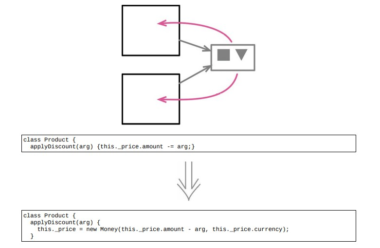

<!--
 * @Author: FEIFEI SUN
 * @Description: 
 * @Detail: 
 * @Date: 2023-04-24 14:17:13
 * 
-->
# 9.4 将引用对象改为值对象



> [反向重构：9.5 将值对象改为引用对象](./9.5_change_value_to_reference.md)

## 使用场景

- 在把一个对象嵌入另一个对象时，有两种方法：引用对象 & 值对象

- 引用对象 & 值对象最明显的差异：在于如何更新内部对象的属性

- 引用对象：在更新其属性时，原对象不动，只更新内部对象的属性

- 值对象：替换整个内部对象

### 重构前

```java
class Person
{
    constructor()
    {
        this._telephoneNumber = new TelephoneNumber();
    }
    get officeAreaCode() {return this._telephoneNumber.areaCode;}
    set officeAreaCode(arg) {this._telephoneNumber.areaCode = arg;}
    get officeNumber() {return this._telephoneNumber.number;}
    set officeNumber(arg) {this._telephoneNumber.number = arg;}
}

class TelephoneNumber
{
    get areaCode() {return this._areaCode;}
    set areaCode(arg) {this._areaCode = arg;}
    get number() {return this._number;}
    set number(arg) {this._number = arg;}
}
```

### STEP1. 将 `TelephoneNumber` 类变成不可变的

- [移除设置函数](../Chapter_11/11.7_remove_setting_method.md)：用[改变函数声明](../Chapter_6/6.5_change_function_declaration.md)把这两个字段的初始值加到构造函数中

```java
class TelephoneNumber
{
    constructor(areaCode, number)
    {
        this._areaCode = areaCode;
        this._number = number;
    }
    // set areaCode(arg) {this._areaCode = arg;}
    // set number(arg) {this._number = arg;}
}
```

- 查看设置函数的调用者，并将其改为重新赋值整个对象

```java
class Person
{
    get officeAreaCode() {return this._telephoneNumber.areaCode;}
    set officeAreaCode(arg)
    {
        // area code
        this._telephoneNumber = new TelephoneNumber(arg, this.officeNumber);
    }
    get officeNumber() {return this._telephoneNumber.number;}
    set officeNumber(arg)
    {
        // number
        this._telephoneNumber = new TelephoneNumber(this.officeAreaCode, arg);
    }
}
```

- `TelephoneNumber` 类已经是不可改变的类，可以将其变成真正的值对象了

### 重构完成🎀
