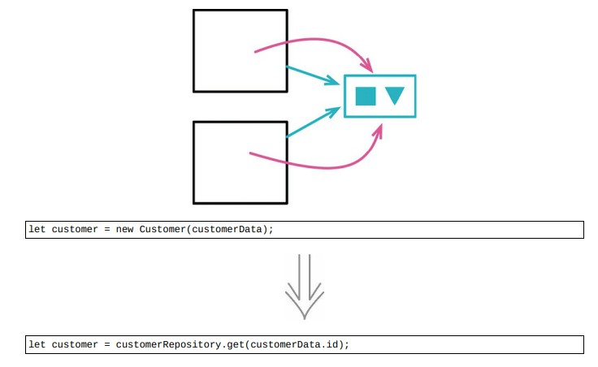

<!--
 * @Author: FEIFEI SUN
 * @Description: 
 * @Detail: 
 * @Date: 2023-04-24 15:35:13
 * 
-->
# 9.5 拆分变量



> [反向重构：9.4 将引用对象改为值对象](./9.4_change_reference_to_value.md)

## 使用场景

- 值对象：每笔订单都会赋值顾客的数据

- 引用对象：对于一个顾客，就只有一份数据结构，会有多个订单与之关联

在更新对象时，引用对象 > 值对象

### 重构前

- `Customer` 对象是值对象

- 如果有 5 个订单都属于 ID = 123 的顾客，就会有 5 个各自独立的 `Customer` 对象

```java
class Order
{
    constructor(data)
    {
        this._number = data.number;
        this._customer = new Customer(data.customer);
        // load other data
    }
    get customer() {return this._customer;}
}

class Customer
{
    constructor(id)
    {
        this._id = id;
    }
    get id() {return this._id;}
}
```

### 重构完成🎀
